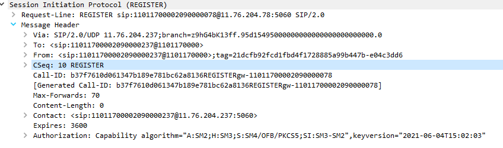
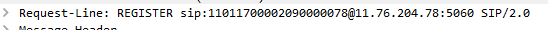
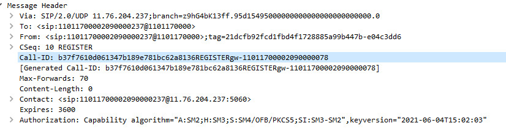
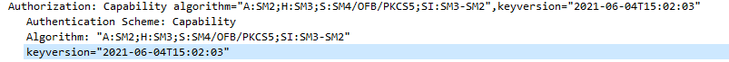
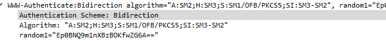
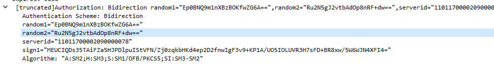

# GB35114标准学习

## 控制信令注册流程

```sequence
具有安全功能的前端设备C -> 具有安全功能的SIP服务器S: 1，REGISTER(携带设备安全能力)
具有安全功能的SIP服务器S --> 具有安全功能的前端设备C: 2,401注册失败(将R1传回)
具有安全功能的前端设备C -> 具有安全功能的SIP服务器S: 3，REGISTER(携带TokenCS = R2+R1+SIP服务器ID + S1注册)
具有安全功能的SIP服务器S --> 具有安全功能的前端设备C: 4,200 OK(携带cryptkey)
```

## 细节

### 1，REGISTER

这个环节前端设备C向SIP服务器S发送`REGISTER`请求，请求里面包含的内容有`Request-Line`和`Message Header`



#### Request-Line



```
REGISTER sip:SIP服务器编码@目的域名或IP地址端口 SIP/2.0
```

以上面截图为例其中`11011700002090000078`为`sip`服务器编码，目的IP地址及端口为`11.76.204.78:5060`

那个`SIP/2.0`是指`SIP`版本号吗?

#### Message Header



- `via`是源域名或`IP`地址端口，这里是`ip`地址，为`11.76.204.237`

- `To`包含了`SIP`设备的编码和源域名

- `From`包含了`SIP`设备编码和源域名
  - 在本阶段`To`和`From`的内容是一样的，因为这是注册信令环节

- `Call-ID`是

- `CSeq`是

- `contact`中包含了`SIP`设备编码和源`IP`地址端口

- `Authorization`是`GB 35114`新增的扩展，当其取值为`Capability`时，携带的参数`algorithm`携带的是设备支持的算法，`keyversion`是指密钥版本号。
  
  - `Capability`对自身支持的算法进行说明，其标志为`A`,`H`,`S`,`SI`，其中`A`指代非对称算法/模式/填充方式，`H`指代杂凑算法或者说hash算法，`S`指代对称算法，`SI`指代签名算法。上述中的`algorithm`就表明支持的非对称算法为`SM2`，支持的摘要算法是`SM3`，支持的对称算法有`SM4/OFB/PKCSS`，支持的签名算法有`SM3-SM2`。
  
  - `keyversion`是指密钥版本号，取值为`FDWSF`的本地时间，`FDWSF`就是指具有安全功能的前端设备

### 2，401注册失败

这个环节`SIP`服务器会将自己产生的随机数`R1`以及自己支持的安全算法传递给`FDWSF`

主要关注`WWW-Authenticate`里面的三个取值

- `Authentication Scheme`这里主要说明是单向认证还是双向认证

- `Algorithm`这里说明`SIP`服务器支持的安全算法，

  - 

  - 上述说明`SIP`支持的非对称算法为`SM2`，支持的摘要算法为`SM3`，支持的对称算法为`SM1/OFB/PKCSS`支持的签名算法为`SM3-SM2`。这里的`SM3-SM2`就是指定了使用`SM2`的证书签名`SM3`形成的摘要

### 3，REGISTER
`FDWSF`收到401响应后，得到`random1`和`algorithm`的值，产生随机数R2，
    

这种验证方式和SSL双向验证有什么区别，为什么SSL客户端验证的时候需要向服务端证明自己有这个私钥，这里通过签名向SIP证明了自己拥有对应的私钥，然后

- SIP如何向FDWSF证明拥有这个签名的私钥，这个私钥不是别人从以前的签名信息复制过来的？
  - SIP会对上一个环节发送过来的随机数进行签名，FDWSF使用公钥解密后对比自己发送的随机数，如果一致，说明这个签名的确是在刚才签发的，并且是SIP本人签发的。
- SIP如何向FDWSF证明自己是本人
  - 签名能够是本人签发的
- SIP如何避免中间人攻击
- SIP如何防止重放攻击
- SIP怎么签名验签
