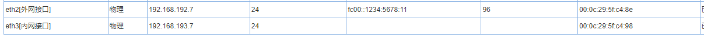
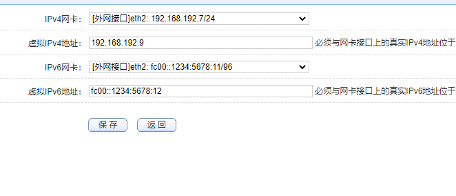
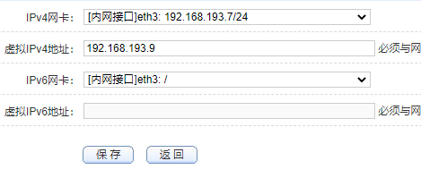
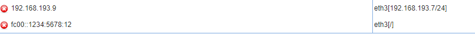
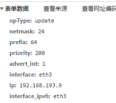
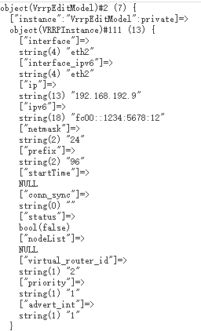
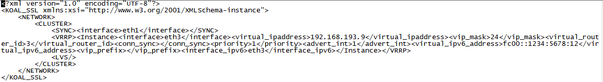
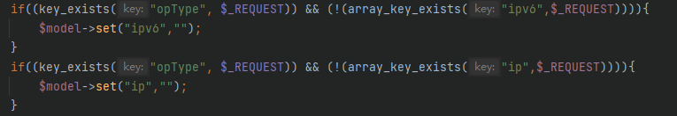
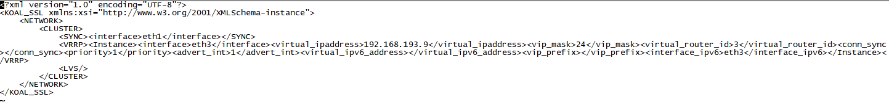
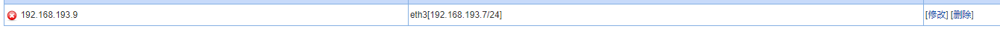

# SP4冗余热备IPv4和IPv6显示问题

## 问题详情

在冗余热备中中设置为有ipv6和Ipv4的网口，然后切换为只有IPv6的网口，冗余热备管理界面仍然显示出Ipv4的ip地址，同理切换成只有Ipv4的网卡，冗余热备仍然显示出ipv6的ip地址

## 问题复现

在网络接口界面将`eth2`设置为既有`ipv6`又有`ipv4`的网口，将`eth3`设置为只有`ipv4`的网口

在冗余界面将`eth2`作为配置网卡，设置好虚拟地址

将网卡修改为`eth3`，配置好虚拟地址

返回界面，此时界面会显示出之前`eth2`的`ipv6`地址

经过测试，如果`eth3`设置为只有`ipv6`地址，此时界面仍旧会显示之前`eth2`配置的`ipv4`地址

## 问题追踪

查看界面传递数据，能够确定只传递了`ipv4`的地址数据

打印`model`的值，发现里面有`ipv6`的值

检查`model`初始化对应的`xml`文件，发现其中仍有`ipv6`的值

## 问题解决

追踪到代码`kssl/GAD/php/web/module/net/ha/vrrp_instance.c.php`对`js`递交的数据进行判定，如果递交的数据中没有`ipv6`或者`ipv4`就将`ipv6`或者`ipv4`对应的值清空

## 测试验证

检查`model`初始化对应的`xml`文件，发现`ipv6`的值已经没有了

界面显示也是正常的

