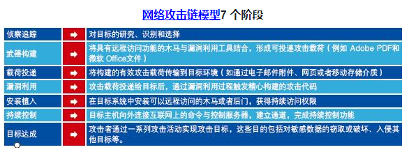
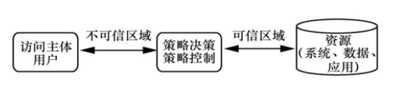
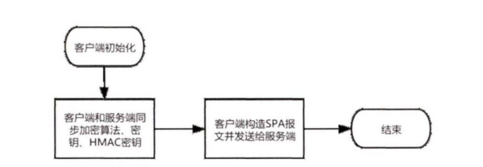
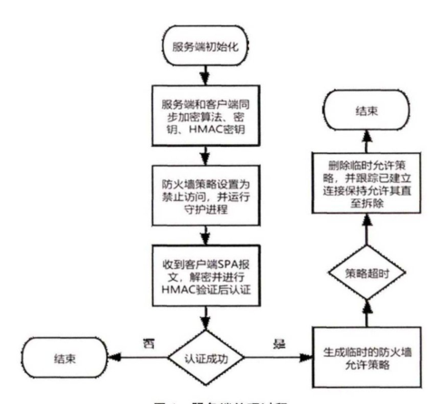
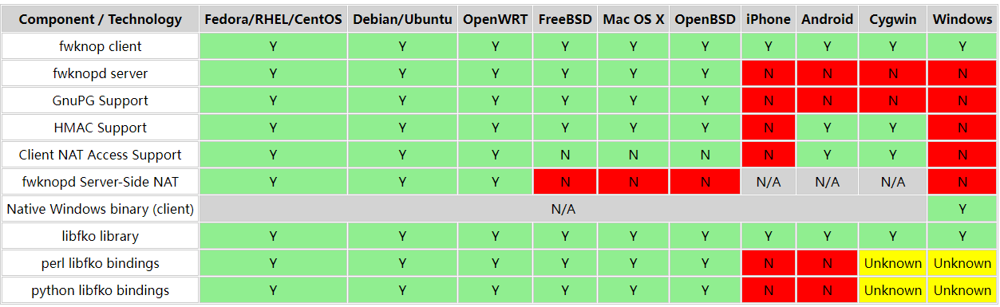
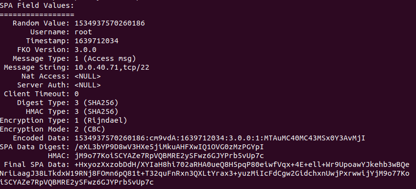
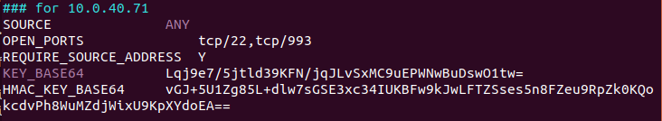
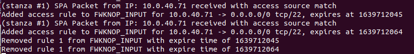
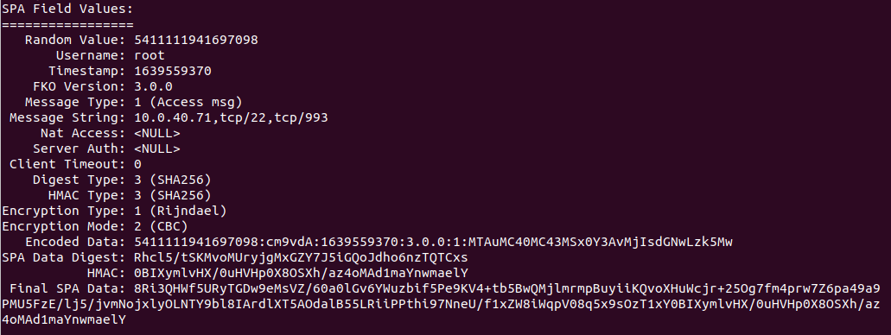

# SPA技术分享

## SPA的意义

根据洛克希德马丁公司(Lockheed Martin)提出的"网络攻击链"(`Cyber Kill Chain`)模型，侦查是网络攻击的重要第一环。



- 如果网络资产或应用存在脆弱性，由于防火墙已允许访问，攻击者可以轻易的发动入侵，例如漏洞利用、进 行密码暴力破解等。 防火墙缺乏对这些类型攻击的 抵御能力从而不得不依赖其他的防御手段

- 攻击者可以对已获得的网络资产发动拒绝服务(Ｄos) 攻击，即使防火墙设计相应的防御措施，也会增加额外的花销

  

## SPA技术介绍

### 零信任防火墙简介

基于上述原因，零信任防火墙应运而生，经典防火墙的工作机制是允许对协议或端口的访问是一个信任授予过程. 因为缺乏对不可信区域的用户、终端等因素的评估从而会导致潜在安全威胁的发生. 而零信任防火墙应当始终默认禁止访问除非客户端基于用户、终端等凭据与服务端进行认证交互从而动态取得防火墙的访问授权.



### SPA简介

单包授权(`Single Packet Authorization,SPA`)是零信任防火墙的一个解决方案，指客户端向服务器发送单个认证数据包以取得访问权
限。通常单包授权认证可通过实现以降低开销服务器收到数据包即进行处理无须向客户端返回连接状态. 对称或非对称加密算法均可用于认证数据包的传输加密. 为防止重放攻击可以对加密的认证数据包附加函数生成消息摘要用于服务器端验证。


区别于经典防火墙单,包授权零信任防火墙运行守护进程以接受客户端发送的认证数据. 默认状态下防火墙处于禁止访问状态. 经过成功校验认证数据后单包授权防火墙临时生成相应的允许规则允许客户端发起连接并在超时后(通常设定较短的超时时间)自动删除临时允许规则. 防火墙守护进程还应跟踪已经建立的连接及其相关联的连接并允许其继续保持连接直至连接拆除

### SPA流程

- 客户端流程

客户端构造SPA认证报文并发送给客户端. 处于加密载荷中的认证报文内容可以由服务端和客户
端事先进行约定例如可包含用户名、防火墙临时允许的策略内容、超时时长等.



- 服务端流程

  服务端的处理流程. 服务端初始化后也需要预先同步用于解密和消息摘要验证的相关加密和消息摘要算法、相关密钥等. 该步骤可以通过静态配置文件实现.
  服务端首先将防火墙设置为默认禁止访问状态并运行SPA认证守护进程.服务端收到客户端发送的SPA报文进行消息摘要验证解密同时对解密后的数据进行认证.通常单包授权防火墙可设定为针对认证失败的连接无需向客户端返回任何信息这可以有效避免攻击者进一步信息搜集.针对认证成功的客户端SPA守护进程生成临时的防火墙允许访问策略并在超时后立即删除. 此时服务端可以被客户端正常连接.服务端跟踪已经成功建立的客户端连接并保持允许至客户端断开连接.

  

## 开源软件Fwknop

`Fwknop`是`Jonathan Bennett`等推动的一个SPA开源项目，诞生于2004年，最新版本(2018年)可以支持对`iptables`,`firewalld(linux)`,`ipfw(FreeBSD和Mac OS X)`,`PF(OpenBSD)`等防火墙进行调用，`Fwknopd`为服务端守护进程，根据客户端发送的`SPA`报文，完成客户端认证，并根据加密报文的具体内容，执行服务端临时防火墙策略的生成，删除和连接状态保持。

下图列出`Fwknop`一些主要特性对各操作系统平台的支持情况，`Fwknop`提供了几乎全平台客户端，极大方便了用户部署。



| SPA      |      |
| :----- | ---- |
| 中文名   | 单包授权机制 |
| 外文名   | Single Packet Authorization |
| 简单介绍 | SPA是由伦敦大学皇家霍洛威学院的`Sebastien Jeanquier`于2006年提出来的，也是后续PK/SPA的问题的标准参考，其用于服务端向潜在攻击者隐匿服务端口，并允许指定客户端使用该端口。 |


## 参考文献

[1]` Jeanquier S . An Analysis of Port Knocking and Single Packet Authorization MSc Thesis.  2006.`

[2]`http://en.wikipedia.org/wiki/Port_knocking`

[3]`http://www.cipherdyne.org/fwknop/docs/SPA.html`

[4]贺春林,彭冰,崔梦天.基于单包授权的零信任防火墙设计方案研究[J].西南民族大学学报(自然科学版),2021,47(02):181-186.


### 字段介绍



没有加密的`SPA pack`包消息的结构如下所示:

```
[Random Value]:[Username]:[Timestamp]:[FKO version]:[Message Type]:[Message String]:[HMAC]
```

- `Random Value`
  - 16位随机数，举例：1534937570260186

- `Username`
  - 客户端用户名，举例：root
- `Timestamp`
  - 时间戳，举例:1639712034
- `FKO Version`
  - 客户端版本，举例:3.0.0
- `Message Type`
  - 消息类型，分为访问或者命令,举例:1(访问标志)
- `Message String`
  - 消息内容，举例:`10.0.40.71,tcp/22`
- `HMAC`
  - 对消息摘要进行加密后字符串，举例:`jM9o77KoiSCYAZe7RpVQBMRE2ySFwz6GJYPrb5vUp7c`

## SPA原理


- 密钥交换

  - 密钥由客户端生成，并通过手动加入服务端配置文件中

    

- 身份验证

  - 检测该报文不是重放（时间戳和随机数)
  - 检测能否通过`HMAC`正确验证
  - 检测正文数据是否是通过服务端设置的密钥进行加密的
  - 正文包含的命令是否属于已授权命令

- 端口开启

  - 添加一个临时规则，允许指定端口向客户端开启

  - 默认30秒后移除该规则，已经连接的保持连接

    

服务端发送一个`UDP`包给服务端，一般默认发送的`60021`端口，服务端收到该包后并进行验证，验证通过后操作打开指定端口(该端口只向客户端开放)


## SPA流程(以fwknop为例)


`fwknop`客户端发送给服务端的`UDP`包括如下信息:

- 16字节随机数据

- 客户端用户名

- 客户端时间戳

- `Fwknop`版本

- 模式(访问或命令)

- 访问(或命令字符串)

- MD5校验和

  

- 发送的数据的生成（看源码）

  在没有进行指定时，默认使用`HMAC_SHA256`进行`HMAC`,默认使用`CBC`加密方式对数据进行加密，将`HMAC`附加在密文后面

- 收到数据的验证(看源码)

- 验证通过的行为（开放端口）(看源码)

  

## SPA的不足

- 发送的是单个的UDP包，如果包中途丢失怎么让客户端知道是丢失了
- 敲门的密钥是在客户端生成的并且保存，有没有更好的管理方式
- 当认证的客户端数量增大，怎么保证准确性？新加入用户需要人为将新用户的密钥保存进入服务端是否过于繁琐？
  - 采用数字证书验证，服务端保存CA证书，客户端使用被该CA证书签发的证书发送过来作为验证，验证通过后开通指定的端口
  - 此外还可以将单包授权零信任防火墙与用户身 份管理系统和终端安全管理系统进行结合从而针对用户身份、终端状态等更加精细化的防火墙控 制能力

## 参考文献

[1]` Jeanquier S . An Analysis of Port Knocking and Single Packet Authorization MSc Thesis.  2006.`

[2]`http://en.wikipedia.org/wiki/Port_knocking`

[3]`http://www.cipherdyne.org/fwknop/docs/SPA.html`

[4]贺春林,彭冰,崔梦天.基于单包授权的零信任防火墙设计方案研究[J].西南民族大学学报(自然科学版),2021,47(02):181-186.

