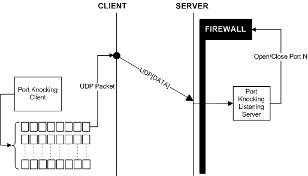

# SPA介绍

SPA是为了解决当前网络上面的不安全问题，即开放的端口允许任何人访问，不怀好意者往往能够依靠端口获取服务的版本信息，然后展开特有攻击。因此如何让端口不被潜在攻击者发现，而只向授权者开放。目前两种解决方案，一个是端口敲门(Port Knocking)，一个是单包授权(Single Packet Authorization)，下面详细介绍这两个方案

## 端口敲门

端口敲门的前提是服务端会隐藏所有端口，对于接收所有访问的数据包，并悄悄丢弃他们

## SPA介绍

## SPA应用

## 其他

