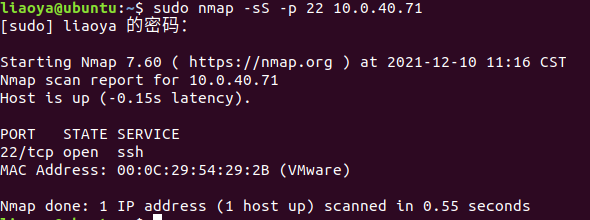
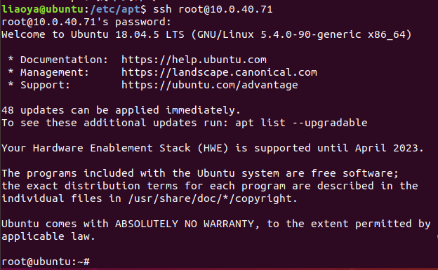
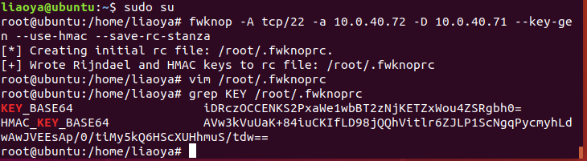
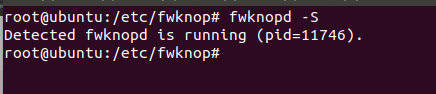
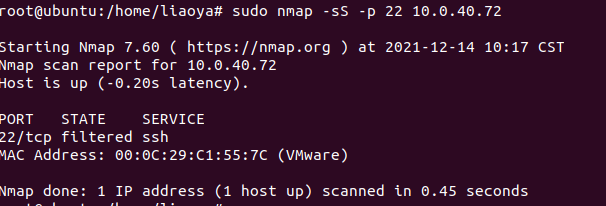
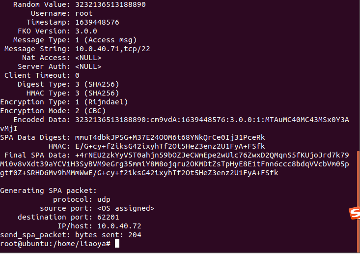
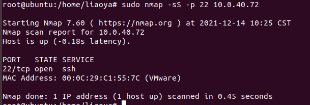
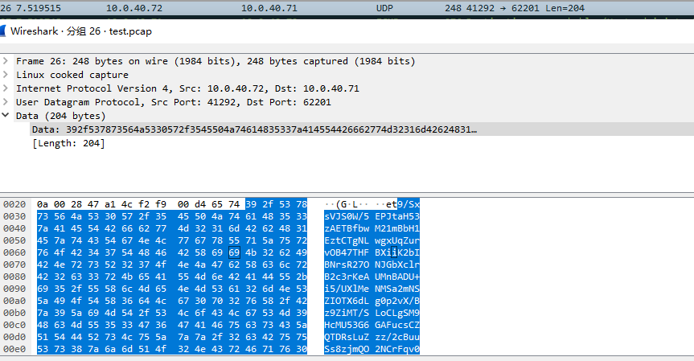

# aldaba入门

## 学习目标

```
研究这个SPA
1）在虚拟机上完成两台机器之间的SPA验证
2) 研究如何将验证过程中的HMAC验证替换为基于数字证书的验证
3）写个预研报告和一个介绍的PPT，下周五完成，下面是参考
   https://www.heibai.org/1154.html
   http://www.cipherdyne.org/fwknop/docs/fwknop-tutorial.html
   http://www.cipherdyne.org/fwknop/index.html
```

## 解决疑问

- SPA是什么？

  只对授权客户端开发对应端口，其他的未授权用户无法扫描到端口。端口一直是被防火墙关闭的，但是对于授权用户可以通过SPA来将这个端口只开放给授权客户端的IP.

  SPA即单包授权(Sing Packet Authorization)的前身是端口敲门(Port Knocking)，端口敲门是为了允许特定客户访问端口的一种做法，比如说使用防火墙过滤了所有端口，在开启守护进程时，该服务会查看访问者访问的端口序列，比如说这个访问者试图访问(12,14,21,7)，那么它就会打开端口22一段时间，让客户端能够连进来，这个查看一般是查看防火墙日志，但是PK还是有固有缺陷，比如假如一个执着的攻击者，它记录客户端访问的序列，然后按照这个序列也能通过守护进程服务打开端口22。

  SPA则有所不同，它通过发送单包，一般是`UDP`包，来进行敲门，守护进程通过对单包内的内容进行解析，一般有时间戳，用户名，hash过的密码，用户名，时间戳。守护进程预先知道密码，它把自己的密码和明文发送的用户名，时间戳一起hash，然后对比生成的hash值和接收到的hash值，如果一样，就开启22端口。。

  

- 端口敲门服务与拒绝服务和中间人攻击
  - 拒绝服务
  
- 62201为什么几次测试的客户端向服务端发送udp包都是发送到62201，这个不是通过查看日志来进行操作的吗?

- 怎么开启多个端口？

- 服务器那边需要应对多个客户端的请求，配置文件的KEY怎么配置

## 常用命令

```
sudo nmap -sS -p 22 10.0.40.71 //扫描10.0.40.71的22端口，关闭或者开启或者过滤(这个由防火墙决定)
```

## 安装配置aldaba

安装配置两个虚拟机`ubuntu18.04`，一个为服务端其`IP`为`10.0.40.71`，一个为客户端其`IP`为`10.0.40.72`

##  安装配置fwknop

- 安装配置两个虚拟机`ubuntu18.04`，一个为服务端其`IP`为`10.0.40.71`，一个为客户端其`IP`为`10.0.40.72`

- 在`10.0.40.71`上面安装`fwknop-server`，其命令为

  ```
  apt-get install libfko3
  apt-get install libgpgme11
  apt-get install libpcap0.8
  apt-get install fwknop-server
  ```

- 在`10.0.40.72`上安装`fwknop-client`，其命令是

  ```
  apt-get install libfko3
  apt-get install libgpgme11
  apt-get install libpcap0.8
  apt-get install fwknop-client
  ```

### 测试

```
sudo nmap -sS -p 22 10.0.40.71
```

从客户端能够扫描到服务端的22端口是开启的



能够通过这个开启的端口`ssh`上服务端



服务端设置防火墙，将所有指向22端口的tcp的包丢弃，已经连接的保持连接

```
iptables -I INPUT 1 -i ens33 -p tcp --dport 22 -j DROP
iptables -I INPUT 1 -i ens33 -p tcp -m conntrack --ctstate ESTABLISHED,RELATED -j ACCEPT
```

使用命令`sudo nmap -sS -p 22 10.0.40.71`已经可以看到`10.0.40.71`上的`22`端口已经处于关闭状态了


使用ssh是连不上`10.0.40.71`


### 设置fwknop

#### fwknop-client设置

```
sudo su
```

```
fwknop -A tcp/22 -a 10.0.40.72 -D 10.0.40.71 --key-gen --use-hmac --save-rc-stanza
```

```
grep KEY /root/.fwknoprc
```

得到生成`key`和`hmac_key`



复制`key`和`hmac_key`到路径`/etc/fwknop/access.conf`


修改`/etc/fwknop/fwknopd.conf`的`PCAP_INTF`的取值为当前主机实际使用的网卡名称


启动`fwknopd`

```
sudo fwknopd
sudo fwknopd -S //查看是否在运行，如果在运行会返回信息
```



如果没有运行，可以使用这个命令来查看启动过程出现了什么问题

```
fwknopd -t
```

查看此阶段的服务端端口开放情况



在客户端使用发送`UDP`包，让服务端的`fwknop`打开端口`22`



扫描`10.0.40.72`的`22`端口开放情况



抓这个阶段的包



