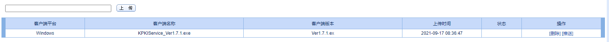
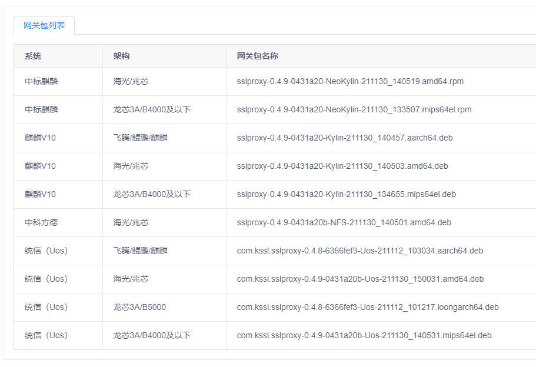

# 任务单

## 任务需求

```
kssl/WEBUI/www/sso/sso_helper.php
kssl/WEBUI/www/sso/sso_param_client_i.php
```

先考虑将所有文件保存在windows文件夹下，包括上传和删除。。。。。。。。。

1.0将平台统一设置为Windows，然后在这种情况下的，上传和删除还有推送的完成

显示的为系统，检查为平台。。。。。。。。。。。。。。。。。

1.1将平台linux设置为linux，然后开始分化完成。。。。。。。上传，删除还有推送

### 代码解析

```
检查对应数组中的每个值是否在那个字符串内存在，如果存在，就将那个键对应的字符串赋值给对方
```

将信息设置为平台，系统，架构，windows类型的平台和系统设置为windows，架构设置为无

linux类型平台设置linux，系统和架构根据名字进行解析

界面上只显示系统和架构


1.1将平台配置为麒麟Uossdfasdfasdfas或者linux，然后在这种情况下的上传和删除还有推送的完成。

即能够识别测试的几种类型，即能够删除测试的几种类型


将上传的类型进行错误处理，即上传的类型没有在该函数数据库内，需要提示用户上传的系统名不正确，然后停止上传

根据文件类型，文件名，自动识别出上传文件的系统架构等信息并显示出来

当前的显示界面为



需要客户端平台修改为下列的系统和架构



## 参考

参考分类

将文件名进行切割，从前往后匹配，匹配固定位置的系统类型，匹配到系统类型数组中去，去赋值，然后根据系统类型的数组继续匹配后续的系统架构类型

如果文件类型为`deb`，同时文件名里面包含了`Uos`，就将其归类到`Uos`目录下

```
$system_info = array(
    'Uos' => array(
        'mips64' => "龙芯3A/B4000及以下",
        'aarch64' => "飞腾/鲲鹏/麒麟",
        'amd64' => "海光/兆芯",
        'loongarch64' => "龙芯3A/B5000",
    ),
    'Kylin' => array(
        'mips64' => "龙芯3A/B4000及以下",
        'aarch64' => "飞腾/鲲鹏/麒麟",
        'amd64' => "海光/兆芯",
        'loongarch64' => "龙芯3A/B5000",
    ),
    'NFS' => array(
        'amd64' => "海光/兆芯",
    ),
    'NeoKylin' => array(
        'mips64' => "龙芯3A/B4000及以下",
        'amd64' => "海光/兆芯",
        'loongarch64' => "龙芯3A/B5000",
    ),
);
```

```
$zh_system = array(
    'Uos' => '统信（Uos）',
    'Kylin' => '麒麟V10',
    'NFS' => '中科方德',
    'NeoKylin' => '中标麒麟',
);
```

## 备忘

为了测试自己建立了`/kssl/Portal/www/Uos/`文件夹，