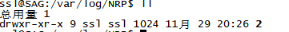
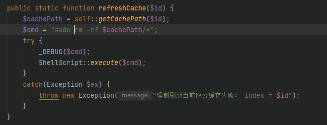
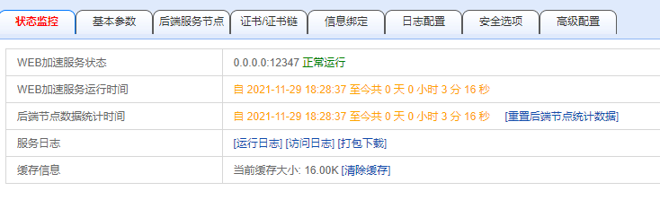
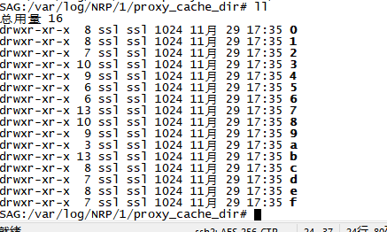
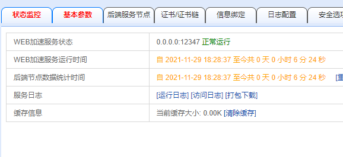
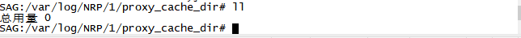

# 清除缓存失败

## 问题详情

点击清除缓存，报错提示

## 问题追踪

在缓存位置`/cfg/NRP/cache/2`查看文件权限

## 问题解决

追查到`  /kssl/GAD/php/srv/nrp/NRPHelper.php:667`代码处对执行命令进行修改，使用`root`用户执行删除操作

## 测试验证

配置反向代理到多图界面，能够在状态监控栏看到有缓存

进入后台也能看到缓存文件

点击清除缓存，状态监控栏已经看到缓存为0了

进入后台，能看到对应的缓存文件为空了

