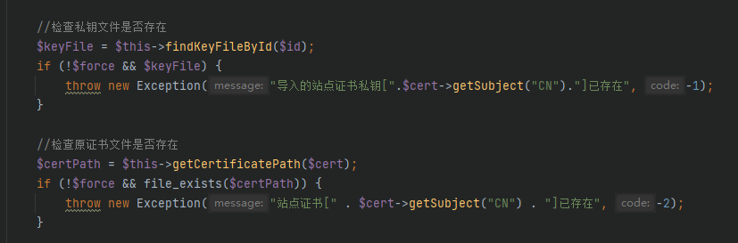
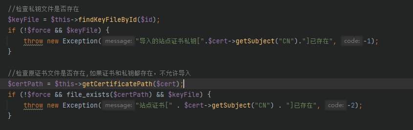
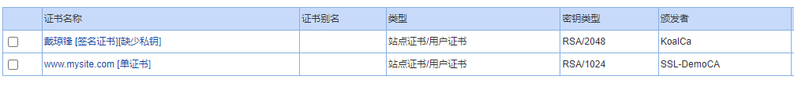
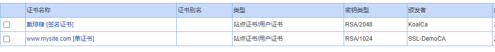

# 站点证书公钥存在，私钥不存在，无法导入证书

## 问题详情

上传站点证书，在后台删除改证书的私钥

上传该证书，报错如下：

## 问题追踪

根据报错提示查到代码`kssl/GAD/php/srv/ica/store/SiteStore.php`，检查原证书文件是否存在时只判定公钥没有判定私钥

## 问题解决

给判定加上私钥，即公钥和私钥都存在时，上传同样的证书会报错，否则会正常上传覆盖掉原来的证书。

## 测试验证

在后台删除某个pfx证书的私钥

导入证书，成功导入

