# SSL握手细节

## 流程

一般而言，握手的交互过程如下所示，其中*号表示的是可选项，表示的是加密进行的。

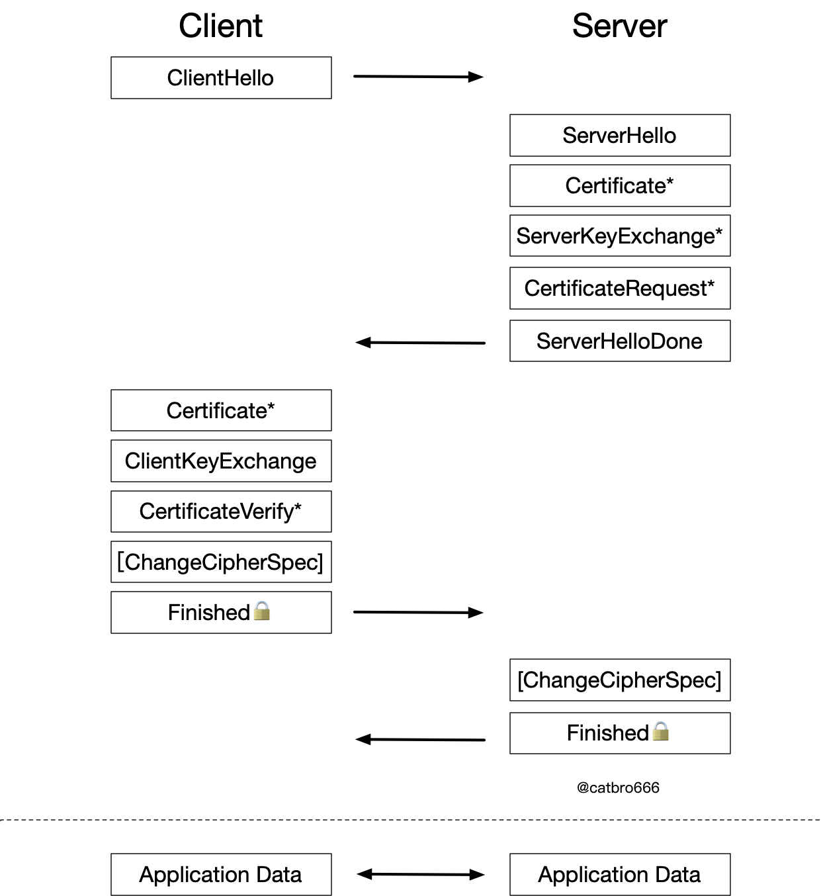

## 细节

以TLS ECDHE密钥交换流程来梳理SSL握手的整个流程，其中密钥交换流程如下所示

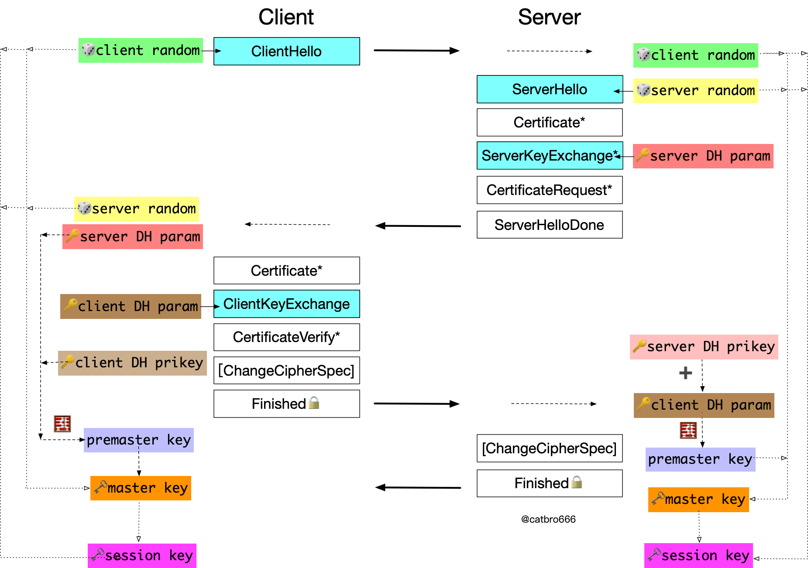

- ClientHello

  客户端向服务端明文发送ClientHello，里面重要的信息包括版本号(Version)，随机数(Random)，算法套件(Cipher Suites)。

  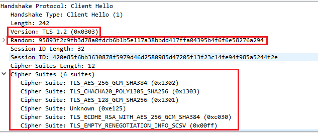

  **版本号(Version)**是客户端告诉服务端这次协商自己希望采用的版本，如果服务端不想采用客户端想要的这个版本，在ClientHello里的supported_versions里面有客户端支持的所有版本，服务端可以从里面选择一个版本作为后续协商版本。supported_versions如图所示

  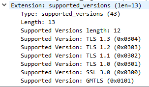

  **随机数(Random)**是客户端通过自己生成的随机数，用于后续的密钥生成。

  **算法套件(Cipher Suites)**是客户端支持的算法组合，其算法组合为**密钥交换算法**+**签名认证算法**+**加密密钥算法**+**摘要算法**

  以算法套件`TLS_ECDHE_RSA_WITH_AES_256_GCM_SHA384`为例，其中`TLS_ECDHE`为密钥交换算法，这个交换算法决定了服务端会在`ServerHello`阶段发送`ServerKeyExchange`，`RSA`是签名认证算法，指定了服务器发送的站点证书是`RSA`密钥的，算法套件是由服务器决定的，也就是说服务器是`RSA`密钥的证书，然后选择了这个算法套件。`AES_256_GCM`是后续生成的对称密钥算法，后续将采用这个加密算法进行加密通信，`SHA384`是摘要算法，后续的`Finished`和`CertificateVerify`采用的摘要算法都是这个算法。

- ServerHello

  ServerHello是服务端告诉客户端自己最终决定的选择，重要信息有**版本号(Version)**，**随机数(Random)**，**算法套件(Cipher Suites)**

  

  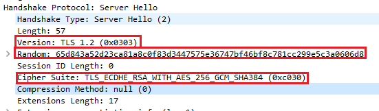

  **版本号(Version)**是服务端选择的版本号，后续的握手都在这个版本的框架下进行。

  **随机数(Random)**是服务端生成的随机数，用于后续的密钥生成。

  **算法套件(Cipher Suites)**中表明此次加密通信使用的各种算法，本次服务端选择的算法套件是`TLS_ECDHE_RSA_WITH_AES_256_GCM_SHA384`

- Certificates

  向客户端展示自己的站点证书，重要的信息有**站点证书的信息（subject）**，**站点证书公钥(subjectPublicKeyInfo)**,**CA给站点证书的签名(encrypted)**

  **站点证书的信息（subject）**表明站点证书的域名，省，机构，公司等等信息，还有给这个证书签发的证书的信息，其中subject是站点证书的信息，issuer是签发者的信息。

  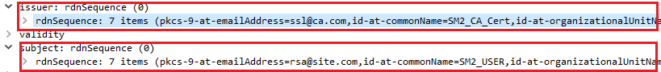

  **站点证书公钥(subjectPublicKeyInfo)**表示站点证书的公钥，后续客户端对于一些重要信息的加密传递给服务端就需要这个公钥进行加密

  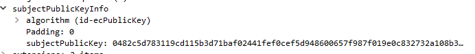

  **CA给站点证书的签名(encrypted)**这个最重要，前面信息的真假需要这个来证明。这个签名是这样形成的，先对前方的证书信息和公钥信息使用`sha256`算法进行摘要，然后使用`RSA`算法的CA证书的私钥对这段摘要进行加密。这个过程中使用的摘要算法和签名算法在`Certificates`里的`signature`予以指定，这个和`ServerHello`算法套件里指定的签名算法和摘要算法不一样，这里是由CA决定而不是服务器。

  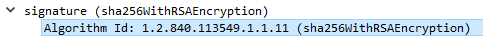

  验证证书真假的流程是这样的，客户端先对证书信息和公钥使用`signature`指定的摘要算法进行摘要，然后使用站点证书指定的CA信息，在自己的信任根证书列表里面寻找到对应的CA证书(如果没找到，直接验证失败)，使用该CA证书的公钥对**签名(encrypted)**进行解密，解密成功，证明了这个证书的确是由该CA证书签发的（解密失败，直接验证失败)，然后将解密后的摘要和自行根据摘要算法进行的摘要进行对比，如果一样，说明证书信息没有被修改(如果不一样，直接验证失败)。然后查看证书里面**站点证书的信息（subject）**，验证自己访问的地址和站点证书的域名是否符合，符合说明自己访问的不是钓鱼网站(不符合，验证失败)。接着检查CRL，看这个证书有没有被吊销啥的，如果时间允许还可以检查一下OCSP。

- ServerKeyExchange
	
	服务端将自己临时生成的ECC公钥发送给客户端，使用自己的私钥进行签名。重要的信息有**椭圆曲线类型(Named Curve)**，**公钥(Pubkey)**,**签名(Signature)**。
	
	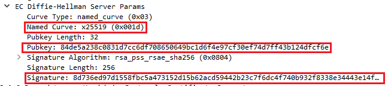
	
	**椭圆曲线类型(Named Curve)**是表明服务端使用的椭圆曲线类型，一般而言，服务端会从客户端的`ClientHello`的拓展项`supported_groups`中选择一个椭圆曲线类型。
	
	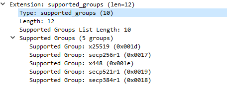
	
	**公钥(Pubkey)**是本次临时生成的ECC密钥对的公钥
	
	**签名(Signature)**过程中加密的私钥是服务端在`Certificates`环节发送证书对应的私钥。因为ECDHE的站点证书的私钥并不参与密钥的生成，所以需要一个该证书的签名来证明服务器拥有该证书的私钥。
	
	
	
- CertificateRequest
  服务端向客户端要求验证客户端证书。重要信息有支持的**证书类型(Certificate types)**支持的**签名摘要算法(Signature Hash Algorithms)**支持的**CA列表(Distinguished Names)**

  **证书类型(Certificate types)**要求客户端提供的证书类型，比如RSA或者DSS等
  
  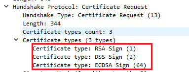
  
  **签名摘要算法(Signature Hash Algorithms)**告知客户端服务端支持的签名摘要算法，客户端需要在该列表中选择签名摘要算法(主要在CertificateVerify环节)。
  
  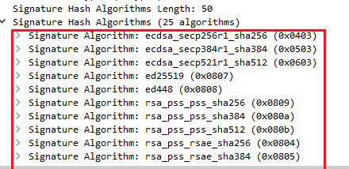
  
  **CA列表(Distinguished Names)**要求客户端提供的证书是由该CA列表中的证书签发的。
  
  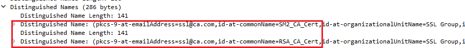
  
- ServerHelloDone

  表示服务端Hello结束，因为在这个环节有可选项，比如`CertificateRequest`，需要服务端设置，一般而言不验证客户端证书，但有时也会验证，所以需要`ServerHelloDone`来告诉客户端Hello结束。

- Certificates(Certficate)

  客户端的证书，其格式与服务端发送的`Certificates`基本一致，可以在这个环节验证以下信息。**客户端发送的证书是由服务端`CertificateRequest`的CA列表可以进行验证的。**

  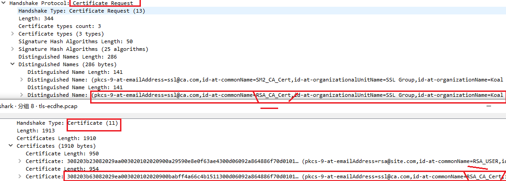

  **客户端发送证书的证书类型是符合服务端`CertificateRequest`要求的**

  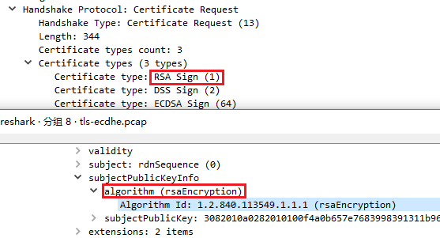

- ClientKeyExChange

  客户端将自己临时生成的ECC公钥发送给服务端，重要的信息就是发送的**ECC公钥(EC Diffie-Hellman Client Params)**

  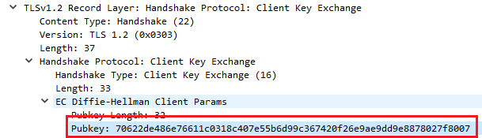

- CertificateVerify

  客户端为了让服务端相信自己的确有这个证书的私钥，就把之前客户端发送给服务端以及客户端收到服务端的消息进行摘要使用自己证书对应的私钥进行加密发送给服务端。其采用的摘要签名算法必须是由`CertificateRequest`消息中提供服务端支持的摘要签名算法列表的。

  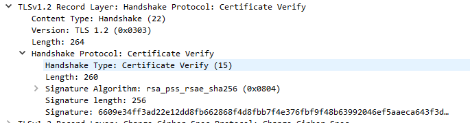

- ChangeCipherSpec

  客户端告诉服务端后续将使用协商好的对称秘钥进行加密。

  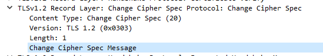

- Finished(Encrypted Handshake Message)

  客户端为了避免自己发送给服务端的明文消息被第三方截获修改，把自己发送的消息和收到的消息进行摘要然后使用协商好的对称秘钥进行加密发送给服务端。

  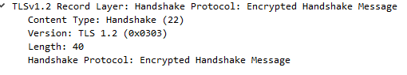

- ChangeCipherSpec

  服务端告诉客户端后续将使用协商好的对称秘钥进行加密

  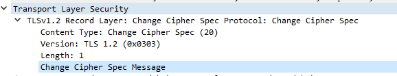

- Finished(Encrypted Handshake Message)

  服务端为了避免自己发送给客户端的明文消息被第三方截获修改，把自己发送的消息和收到的消息进行摘要然后使用协商好的对称秘钥进行加密发送给客户端。

  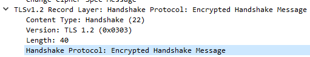

## Session ID 和Session Ticket

Session复用是在**进行过一次完整握手之后**，在**限定时间**内再次通话时，直接复用前一次**握手的结果(master key)**，来生成**新的会话密钥(Session key)**，从而节省验证的时间，其基本流程如下所示

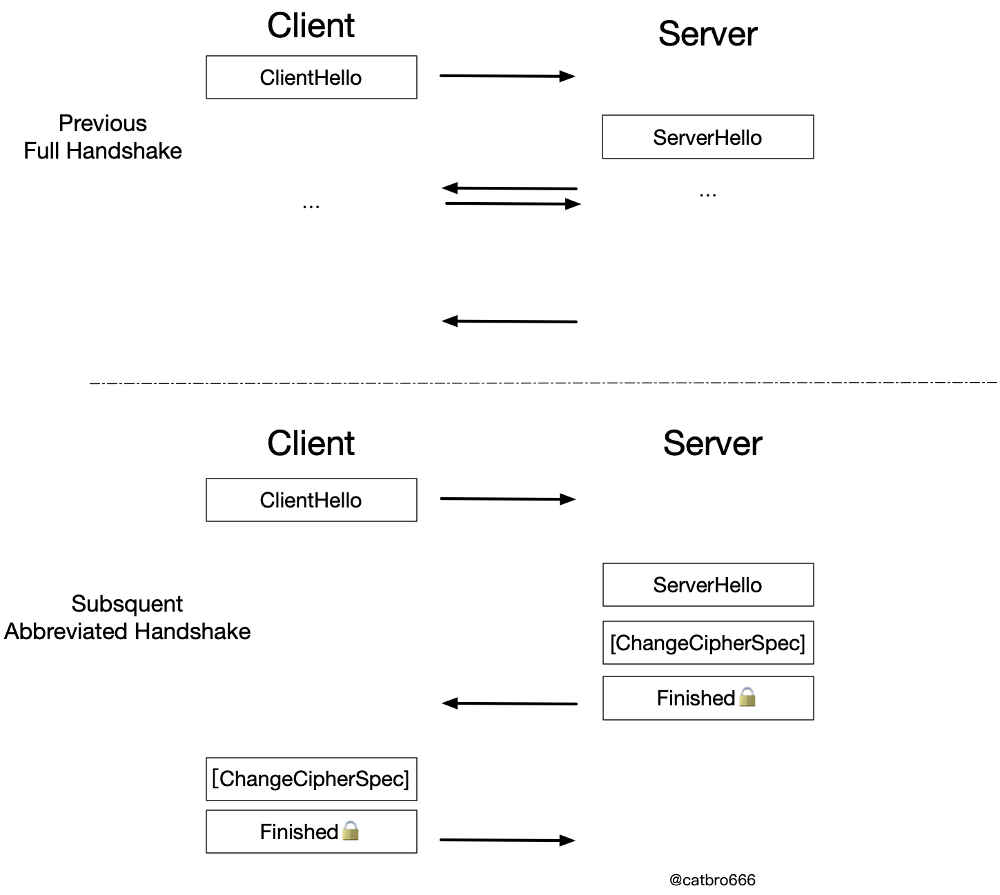

### Session ID会话重用

在一次握手结束后，服务端会将Session保存，后续客户端想要重用该Session，在ClientHello中包含其Session ID，服务器收到ClientHello后，如果其SessionID不为空，就会在服务端cache中进行查找，如果查找到且未过期，则进行会话重用，否则回退到完整的握手流程。找到Session后，服务端会根据Session记录的master key和新的两个随机数客户端随机数和服务端随机数生成新的sessionkey作为会话的对称密钥，其复用流程如下所示

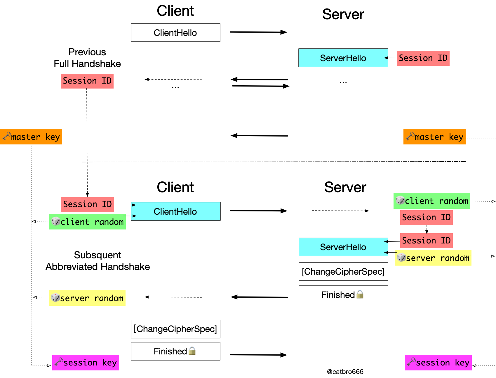

### Session Ticket会话重用

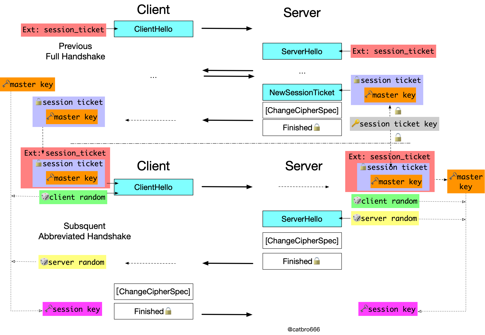

## 一些问题和答案

