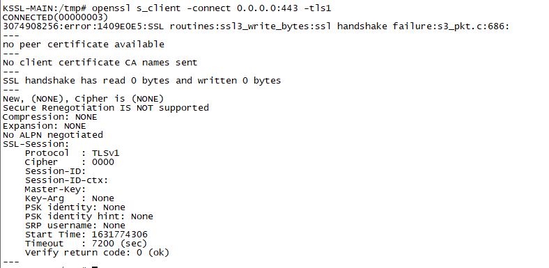
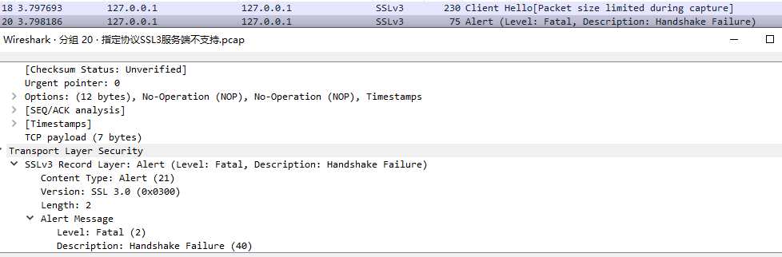
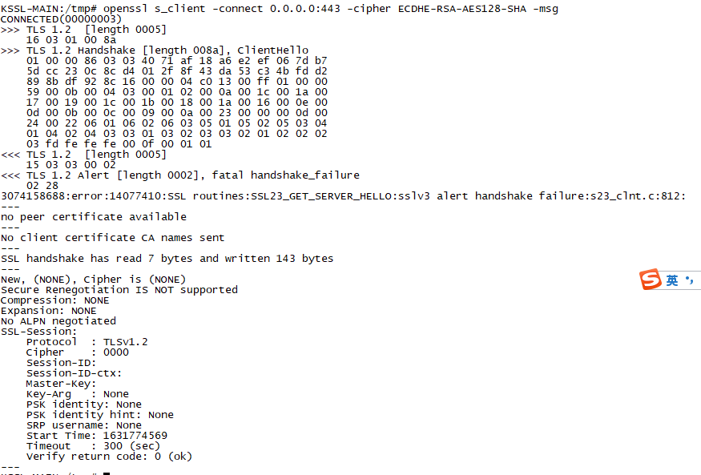
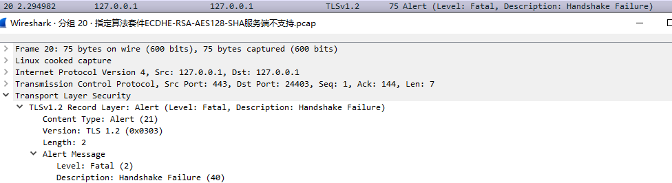
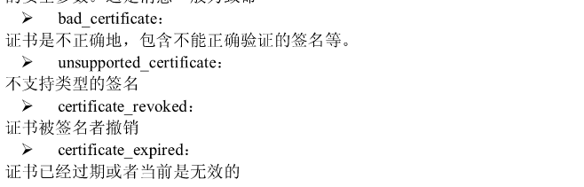

# SSL作业

## 写出以下情况对应的报错信息

- 初始化失败
  - 证书和私钥不匹配 
  - 证书和算法套件不匹配
- 握手时失败 
  - 协议不支持
  
    当客户端指定的协议服务端不支持的时候，服务端会根据Alert协议，报fatal错误`fatel(2)`，并中断SSL连接。
  
    使用s_client仿真指定协议为SSL3，同时在网关禁用SSL3协议，运行截图如下：
  
    
  
    对SSL握手情况进行抓包，能够看到错误提醒`fatal(2)`，其截图如下：
  
    
  
  - 算法套件不匹配 
  
    当客户端指定的算法套件服务端不支持的时候，服务端会通过Alert协议报错`Fatal(2)`，并中断SSL连接。使用s_client指定算法套件为`ECDHE-RSA-AES128-SHA`并在服务端支持的协议中去掉该协议。运行截图如下:
  
    
  
    对握手过程进行抓包，能够很清晰看到`Fatal(2)`的报错信息，抓包截图如下：
  
    
  
  - 签名算法不支持
  
    这个在指定算法套件的时候就已经指定了签名算法。过程如指定的算法套件服务端不支持。
  
  - 客户端身份验证失败（没提交证书、证书过期、没有对应的上级证书链、证书被吊销CRL）
  
    
## 协议理解
  - SSL握手协议是如何保证安全性的，谈谈你的理解

    SSL握手主要达到了以下几个安全目标，机密性，认证性，完整性，防重放。

    机密性主要需要保证认证性，完整性的前提下协商出一个只有双方知道的对称密钥，这个对称密钥主要通过密钥协商算法来生成，以RSA密钥交换算法为例，它使用明文传递客户端随机数和服务端随机数，然后使用RSA证书上附带的公钥对客户端生成的`premasterkey`进行加密发送，双方用三个随机数使用指定的密钥导出函数生成`masterkey`，生成`sessionkey`。RSA算法保证第三个随机数`premasterkey`是安全的。

    其中认证性包括两个部分，一个是对方是合法的，这个是通过数字证书来实现的，即以客户端信任的CA证书签名的服务端证书来让客户端信任服务端是可信的。另一个是和我通信的是对方本人，这个需要和完整性相结合来进行认证，当确保对方证书是完整的情况下，通过证书的明文信息上的域名与我通信的域名一致来保证和我通信的是本人。

    完整性，这个也包括两个方面，一个是证书信息的完整性，这个通过证书明文信息后面附加的签署该证书的CA证书签名的证书明文信息的Hash值来保证，当客户端通过该CA的公钥对这段密文进行解密，与证书明文摘要对比一样后，能够说明这个证书的确是该CA签署的以及证书信息没有被中途修改。另一个是握手过程中的完整性，这个主要是通过协商完成得到只有双方知道的对称密钥后，使用密钥对之前通信过程中的握手信息进行摘要加密，来防止双方握手过程中信息被篡改。

  - 国密协议与TLS协议的主要区别 

    国密协议修改自TLS1.1，总体上和TLS协议差异不大。主要的区别有，新增了国密的SM1/2/3/4算法，定义了多个算法套件，比如`ECC_SM4_SM3`和`ECDHE_SM4_SM3`。`ECDHE_SM4_SM3`要求必须双向认证。此外，国密SSL采用双证书体系：一个签名证书，一个加密证书，其中签名证书用于身份认证，加密证书用于密钥交换，发送`Certificate`消息时需要发送两个证书。

  - 统计使用前面几种典型算法套件进行握手时的密码运算次数（签名/验签/加密/解密/随机数生成

      - 典型算法套件`AES256-SHA`
          - 签名
          - 验签
          - 加密
          - 解密
          - 随机数生成