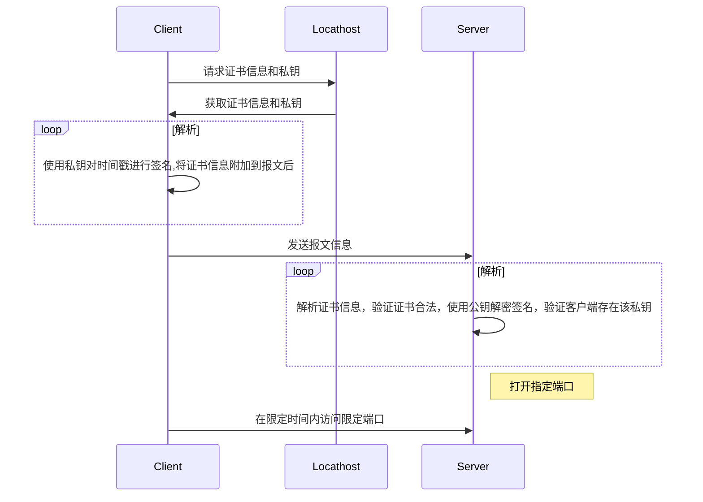

# fwknop增加证书功能

## 证书功能流程

```mermaid
sequenceDiagram
    participant Client
    participant Locathost
    participant Server
    Client->>Locathost: 请求证书信息和私钥
    Locathost->>Client: 获取证书信息和私钥
    loop 解析
        Client->>Client: 使用私钥对时间戳进行签名,将证书信息附加到报文后
    end
    Client->>Server: 发送报文信息
        loop 解析
        Server->>Server: 解析证书信息，验证证书合法，使用公钥解密签名，验证客户端存在该私钥
    end
    Note right of Server: 打开指定端口
    Client->>Server: 在限定时间内访问限定端口
```

