# 安全网关项目详解

## 命令行demo 搭建

### 前置条件

- 下载好`SSO报文模式demo`
- 将测试用证书链上传到网关
- 将测试用证书上传到本地

### 网关配置

#### 服务管理配置

以网关`IP`为`10.0.40.73(192.168.190.7)`为例

- 基本参数配置如下图所示:

  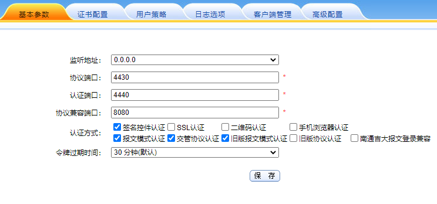

- 证书配置如下图所示，只需要将可信的证书链进行勾选即可

  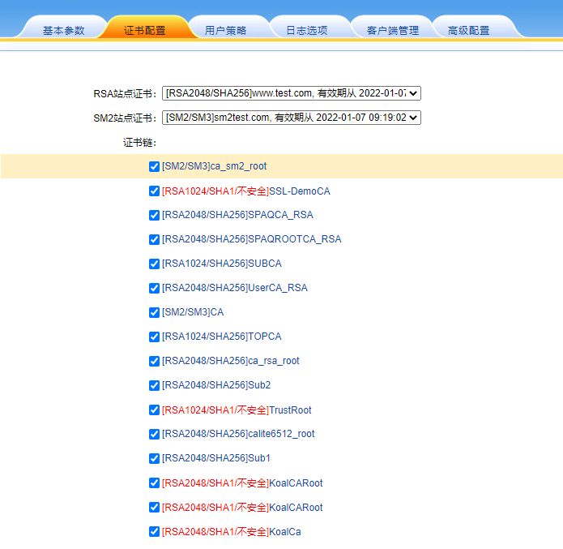

- 用户策略如下图所示

  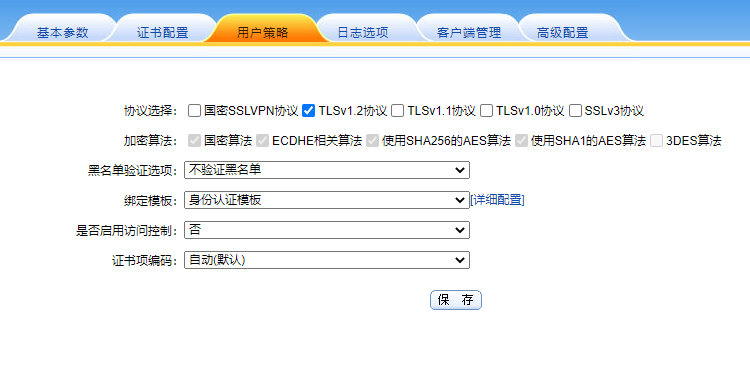

- 日志选项如下图所示

  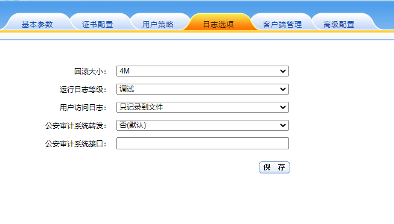

- 客户端管理如下图所示

  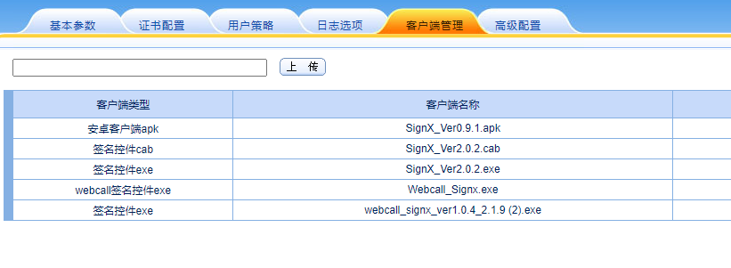

- 高级配置如下图所示

  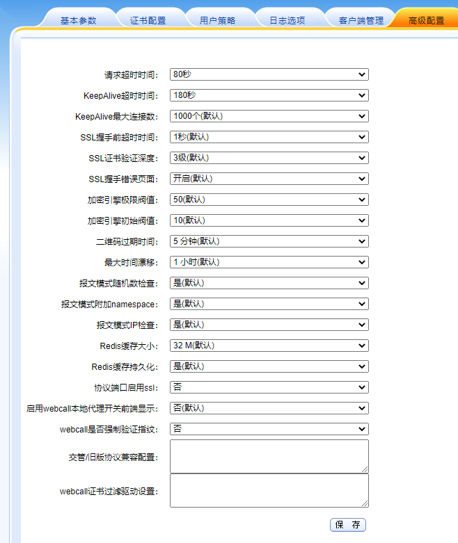

#### 应用管理配置

在用户管理->应用管理界面点击新增

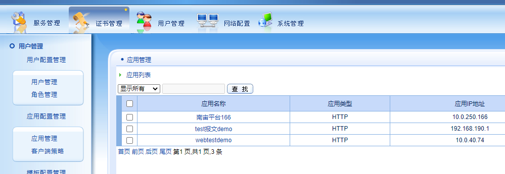

按下述进行填写

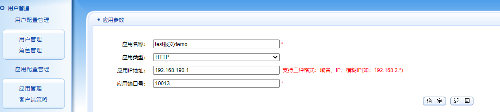

在界面管理处点击配置按钮，配置`ID`和`KEY`

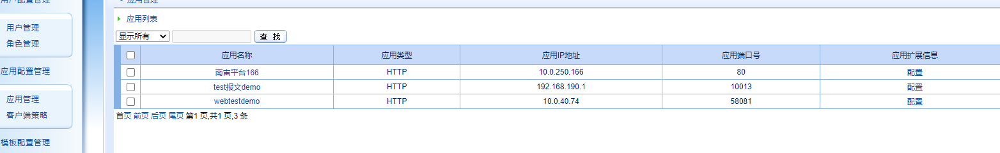

在应用`ID`处填写`ID`，点击保存，然后点击重新生成，再点击保存

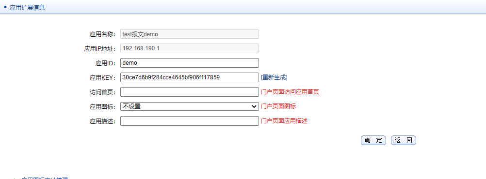

### 测试客户端配置

客户端默认配置如图所示

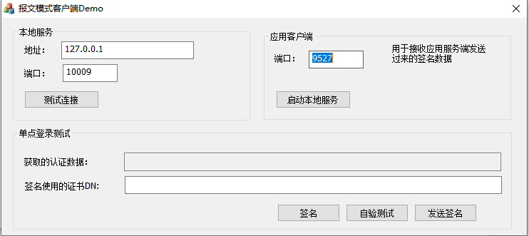

客户端测试配置填写如下所示

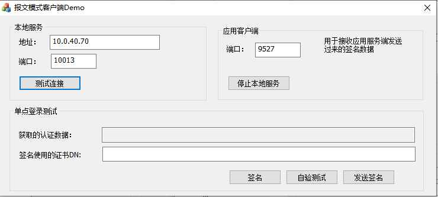

测试连接，提示连接成功

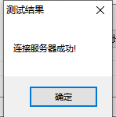

### 测试服务端配置

默认的服务端配置如下图所示

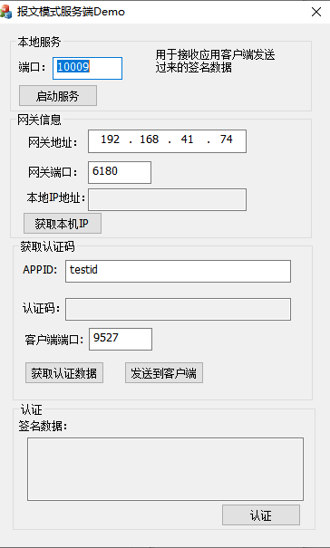

服务端测试配置填写如下所示

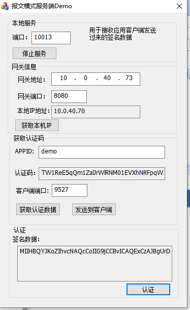

### 测试

在客户端点击获取本机`IP`，获取通过说明网关地址和端口填写正确。将获取到的本机`IP`地址填写到网关应用管理中的应用服务器`IP`地址，如本例中的`10.0.40.70`，端口填写本地服务中配置的端口，例如本例中的`10013`

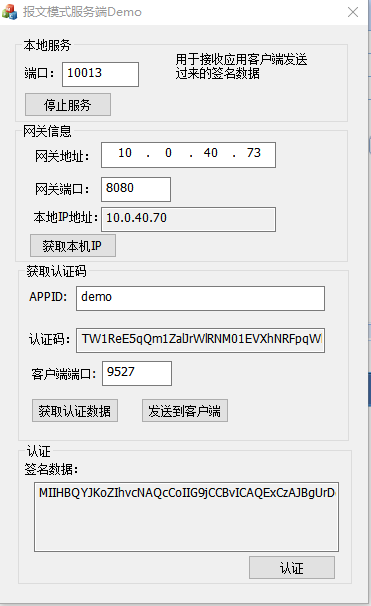


点击获取认证数据，如果填写的`APPID`没有错误，那么将获取到一段字符串，点击发送到客户端，将数据发送到客户端，客户端点击签名，再点击发送签名。服务端点击，认证，认证通过。

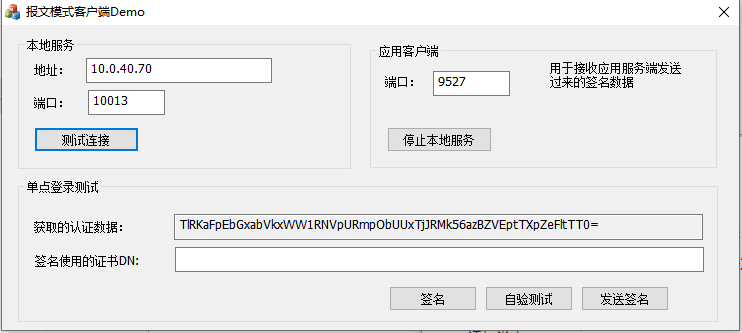


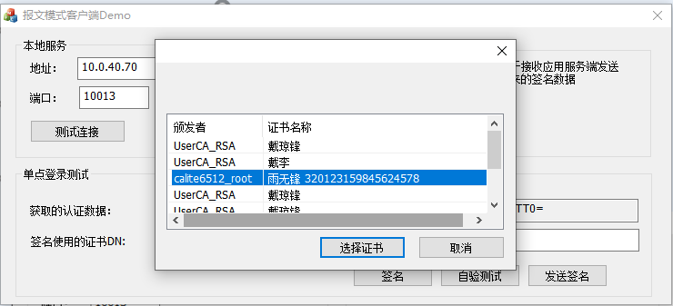

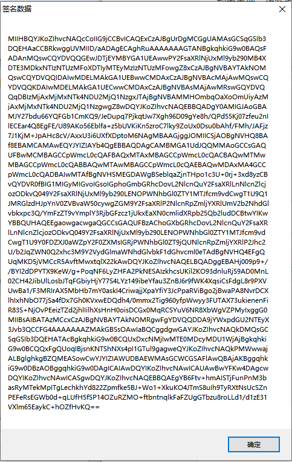


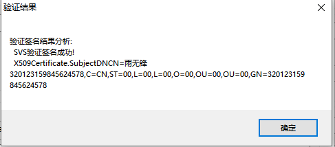

## Web demo搭建

### 前置条件

- 下载安装好`docker`，本次测试以`ubuntu18.04`为例
- 配置好应用服务器`IP`为`10.0.40.74`
- 下载好`demo`文件夹
- 将测试用证书链上传到网关
- 将测试用证书上传到本地

### 网关配置

参考命令行`demo`网关配置

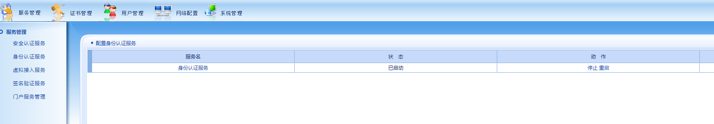

### 应用服务器搭建配置

以`ubuntu 18.04`为例，该电脑`IP`为`10.0.40.74`

- 查看`docker`版本

```
root@liaoya-W65KJ1-KK1:/home/liaoya# docker --version
Docker version 20.10.12, build e91ed57
```

- 下载安装`tomcat`

  ```
  docker pull tomcat:9.0
  ```

- 查看下载的`tomcat`镜像

  ```
  root@liaoya-W65KJ1-KK1:/home/liaoya# docker images tomcat:9
  REPOSITORY   TAG       IMAGE ID       CREATED       SIZE
  tomcat       9         b8e65a4d736d   3 weeks ago   680MB
  ```

- 启动运行

  ```
  root@liaoya-W65KJ1-KK1:/home/liaoya# docker run -d -p 58080:8080 --name webdemotest01 tomcat:9
  cc10665deaaee29e97be62159ef2b7ffa023fb790e079af6b65dead151d94a05
  ```

  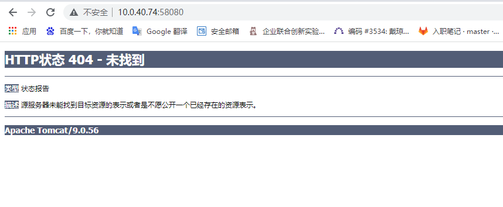

  查看`docker`内部环境，发现`webapps`内是空的，将`webapps.dist`内的文件复制进去

  ```
  docker exec -it cc10665deaaee29e97be62159ef2b7ffa023fb790e079af6b65dead151d94a05 bash
  root@cc10665deaae:/usr/local/tomcat# cd webapps
  root@cc10665deaae:/usr/local/tomcat/webapps# ls
  root@cc10665deaae:/usr/local/tomcat/webapps# cp -r /usr/local/tomcat/webapps.dist/* /usr/local/tomcat/webapps
  ```

  访问应用服务器

  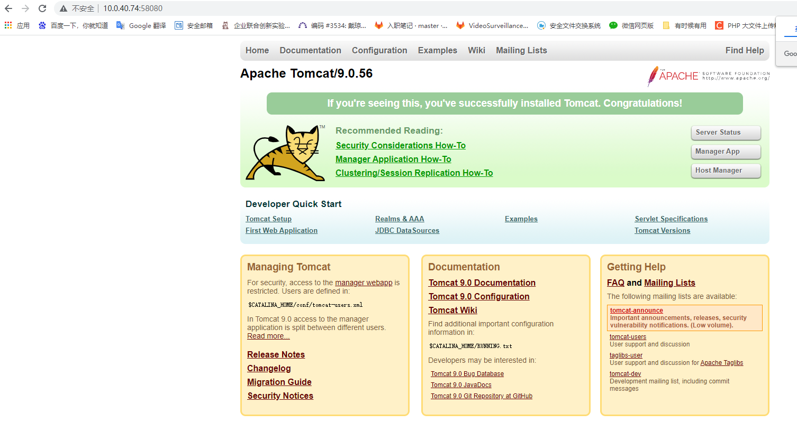
  
- 修改网盘上下载`demo`的配置文件

  - 在`/demo/WEB-INF/web.xml`文件增加配置如下(下载的`demo`项目，`web.xml`文件已经添加好了，在其他项目中需要自行增加)：

    ```
    <filter>
    		<filter-name>RequestFilter</filter-name>
    		<filter-class>koal.gateway.agent.filter.RequestFilter</filter-class>
    		<init-param>
    			<param-name>AgentConfig</param-name>
    			<param-value>/WEB-INF/config/KlAgent.xml</param-value>
    		</init-param>
    		<init-param>
    			<param-name>log4j</param-name>
    			<param-value>/WEB-INF/config/log4j.properties</param-value>
    		</init-param>
    	</filter>
    	<filter-mapping>
    		<filter-name>RequestFilter</filter-name>
    		<url-pattern>/authentication.do</url-pattern>
    	</filter-mapping>
    ```

  - 添加类库，查看`/demo/WEB-INF/lib`下的类库是否和图一致，在`demo`中已经添加好了，其他项目需要将`demo`中的类库移入`lib`文件夹内

    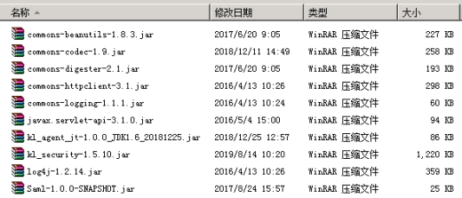

    ```
    root@10ee6f93d597:/usr/local/tomcat/webapps/demo/WEB-INF/lib# ls
    Saml-1.0.0-SNAPSHOT.jar      commons-httpclient-3.1.jar             kl_security-1.5.10.jar
    commons-beanutils-1.8.3.jar  commons-logging-1.1.1.jar              log4j-1.2.14.jar
    commons-codec-1.9.jar        javax.servlet-api-3.1.0.jar
    commons-digester-2.1.jar     kl_agent_ga-1.0.0_JDK1.6_20190321.jar
    ```

  - 删掉冲突类(`demo`中无冲突类，不需操作)

    - 将原应用中`lib`目录下的`J2EE_Agent_2_2_5_JDK15.jar`包删除。
  - 如果有`commons-codec-xxx.jar` 两个版本的包则删除低版本的包。
    
- 新增`/demo/WEB-INF/config/KlAgent.xml`文件
  
  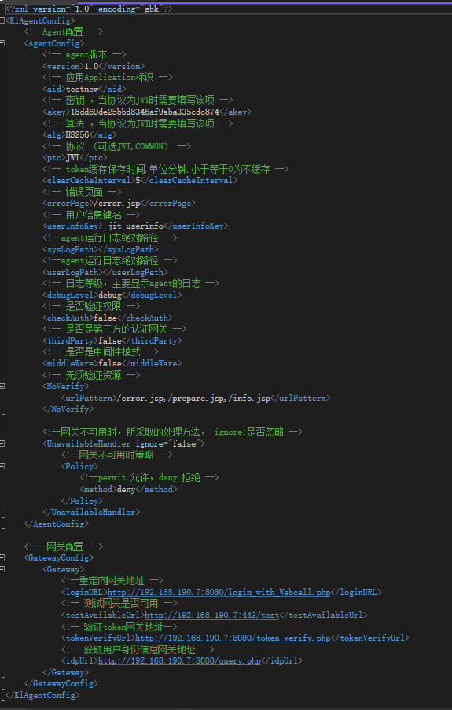
  
- 修改`AgentConfig`
  
  - 将`aid`和`akey`修改为网关应用管理上的`aid`和`akey`
    - 将是否中间件中的`false`修改为`true`
  - 修改后的配置如下图所示
  
    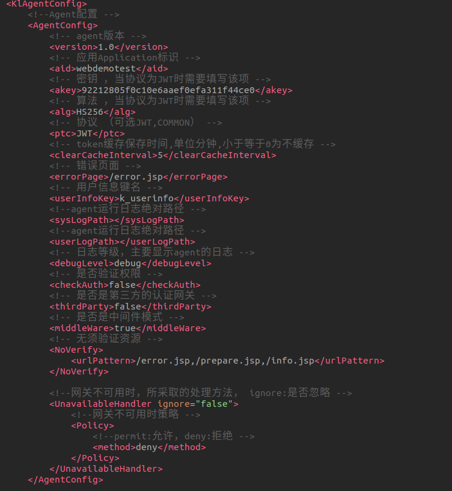

  - 修改网关配置，将`demo`中的默认网关`IP`修改为当前网关`IP`修改后的配置如下图所示。

    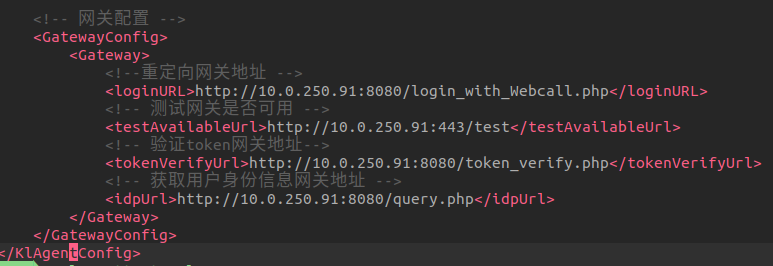

- 将从网盘下载的`demo`文件夹复制进入`docker`的`webapps`文件夹内

  ```
  docker cp -a demo/ cc10665deaaee29e97be62159ef2b7ffa023fb790e079af6b65dead151d94a05:/usr/local/tomcat/webapps
  ```


### 测试

- 访问网关`demo`地址，此时应用服务器会重定向到网关身份验证服务

```
http://10.0.40.74:58080/demo/demo.jsp
```

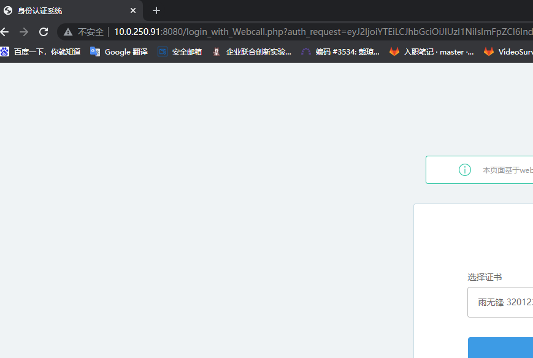

- 选择证书进行验证

  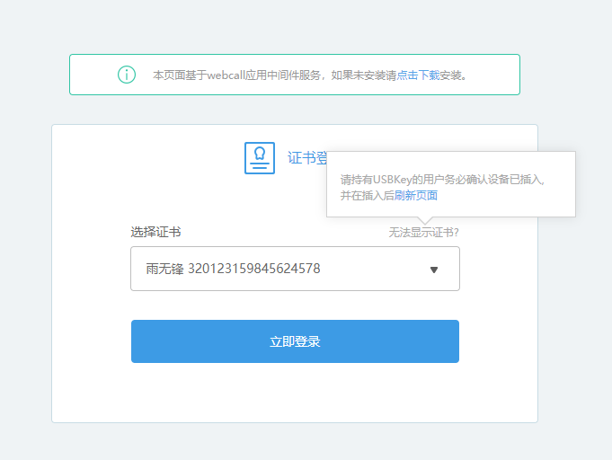

- 验证通过进入应用服务器网页

  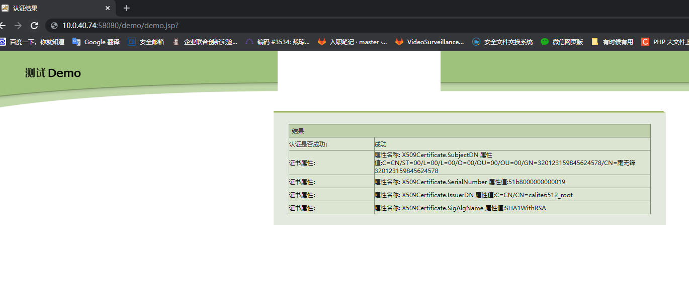

  


## Web应用改造

将之前的`docker`容器保存为镜像

```
root@liaoya-W65KJ1-KK1:/home/liaoya/github/demo# docker commit cc10665deaae webdemotest:1.0
sha256:a0a8887912c951b212f2bf75ef999626626fd6945bbcfffacbe8ed60537aaa75
```

关闭容器，重新打开容器

```
root@liaoya-W65KJ1-KK1:/home/liaoya/github/demo# docker stop cc10665deaae
cc10665deaae
root@liaoya-W65KJ1-KK1:/home/liaoya/github/demo# docker rm cc10665deaae
cc10665deaae
root@liaoya-W65KJ1-KK1:/home/liaoya/github/demo# docker run -d -p 58080:8080 --name webdemotest webdemotest:1.0
10ee6f93d5978ae3a2092d212836418d5b3f1296c4b84c483c54468a88849699
```

以`tomcat`自带的`examples`项目为例进行修改测试

### 配置web.xml文件


### 添加类库

### 修改配置文件

### 测试

