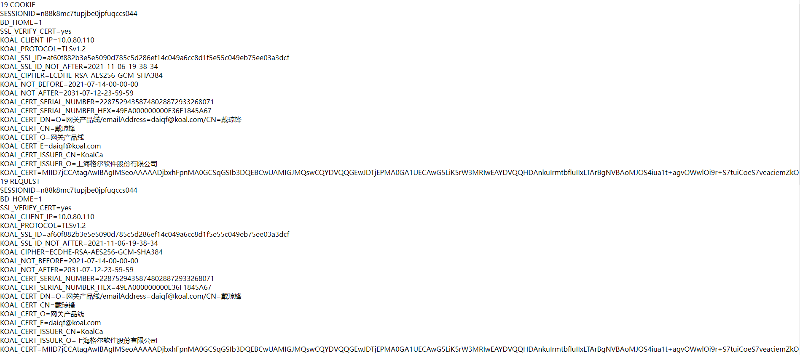
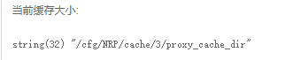
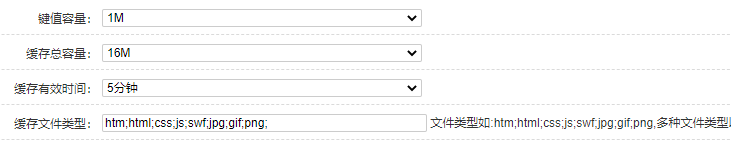
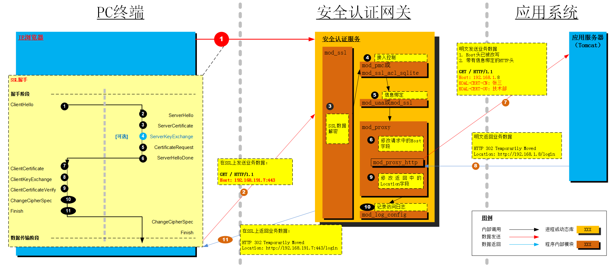

# 考核作业

## 作业详情

```
你的阶段再评估会在下周进行，考核内容将涉及网关产品核心功能-反向代理，一周时间准备
  1.  搭建容器 http://git.koal.com/gw-server/docker/http-testpage，配置网关代理容器
  2.  利用http-testpage 演示信息绑定功能
  3.  利用http-testpage 演示302跳转
  4.  上传1G大小文件到 http-testpage
  5.  利用http-testpage 演示缓存功能
```


## 解决问题

- 安装Docker

- 使用Docker安装镜像

  ```
  docker build -t rmimage -f Dockerfile .
  ```

  -t:指定镜像名字

  -f:指定Dockerfile路径

  .:指定当前目录进行编译

  ```
  root@ubuntu:/home/liaoya/github/http-testpage# docker build -t rmimage -f Dockerfile .
  Sending build context to Docker daemon  12.48MB
  Step 1/3 : FROM php:5.6-apache
   ---> 24c791995c1e
  Step 2/3 : COPY config/php.ini /usr/local/etc/php/
   ---> 86c1a51b4d6f
  Step 3/3 : COPY www/ /var/www/html/
   ---> b2fad630a636
  Successfully built b2fad630a636
  Successfully tagged rmimage:latest
  ```
  
- 使用镜像运行项目

  ```
  docker run --rm -p 8080:80 git.koal.com:4567/gw-server/docker/http-testpage
  ```

  - docker run: 创建一个新的容器并运行一个命令
  - -p 将容器的80端口映射到本地主机的8080端口上
  - git.koal.com是镜像名字
  - --rm:在容器退出时自动清理容器内部的文件系统
  
  ```
  docker commit --author "daiqf" --message "修改了端口对应" 990292c3631d test2
  ```
  
  将容器创建为镜像，命名为test2

## 任务流程

- 使用容器创建一个网站，网页就是那些

```
  git clone http://git.koal.com/gw-server/docker/http-testpage.git
   docker build -t daiqf/test:0.0.1 .
  docker images
  docker run -d --rm -p 8080:80 daiqiongfeng/test:0.0.1
```

- 使用网关的反向代理到这个网站

- 测试网关的信息绑定功能

  ```
  将客户端验证设置为强制验证
  勾选自己上传到浏览器的证书对应的签发者CA证书
  再信息绑定栏目设置开启，并勾选信息绑定键值对
  ```

  `https://10.0.80.141:18556/httpvars.php`打开这个链接，这里会显示网关到应用服务器的请求信息，包括信息绑定项，可以看到证书信息再`COOKIE`上显示出来了。

  

- 测试网关的缓存功能

  协同网关HTTP代理的缓存位置在哪？

  

  以下几个参数分别是什么意思?

  

  键值容量:

  缓存总容量:

  缓存有效时间:

  缓存文件类型表示拥有这种后缀的文件将被缓存到指定文件夹内

  测试过程:

  第一，打开

- 测试302跳转

  

  在反向代理中的Host字段改写里面选择使用自定义的Host字段

  连接网址`https://10.0.80.141:18554/302/`

  第一个修改网关。。。好像有点难

  使用apache开反向代理，然后手动设置。。。。。好像阔以

  在安全认证网关和应用系统之间增加一个nginx代理，由它来进行nginx代理控制和改写host字样以及location字样

- 上传1G大小的文件到网站

  修改php.ini中的限制为2048m

  修改http代理中http中请求body最大长度为不限制

  参考链接

  https://blog.csdn.net/weixin_45525177/article/details/103718811?spm=1001.2101.3001.6650.1&utm_medium=distribute.pc_relevant.none-task-blog-2%7Edefault%7EOPENSEARCH%7Edefault-1.no_search_link&depth_1-utm_source=distribute.pc_relevant.none-task-blog-2%7Edefault%7EOPENSEARCH%7Edefault-1.no_search_link

## 测试验证

