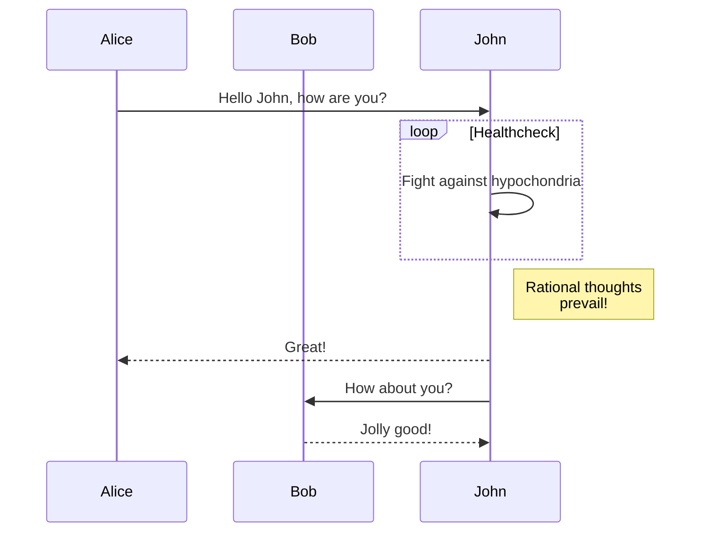
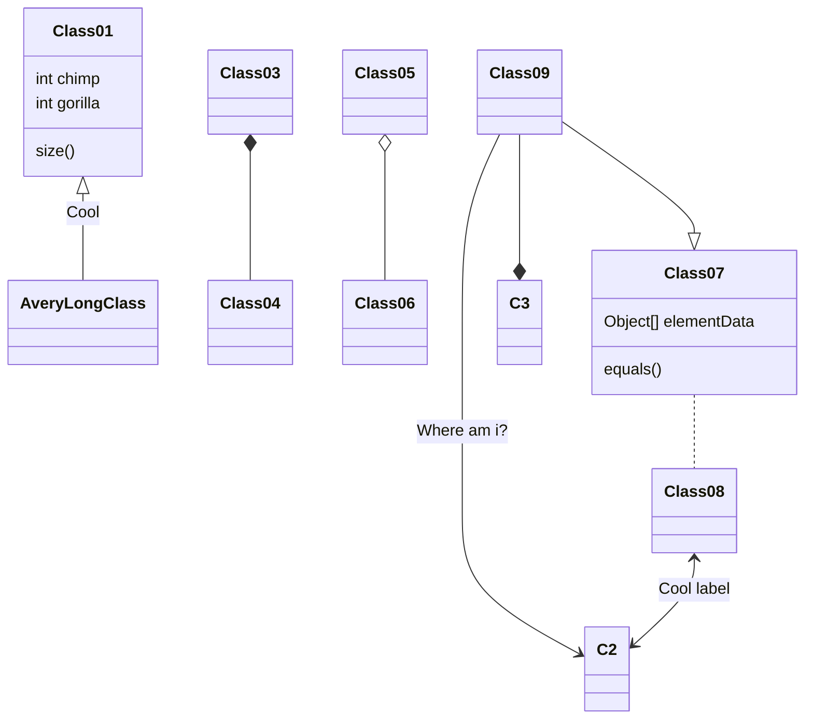
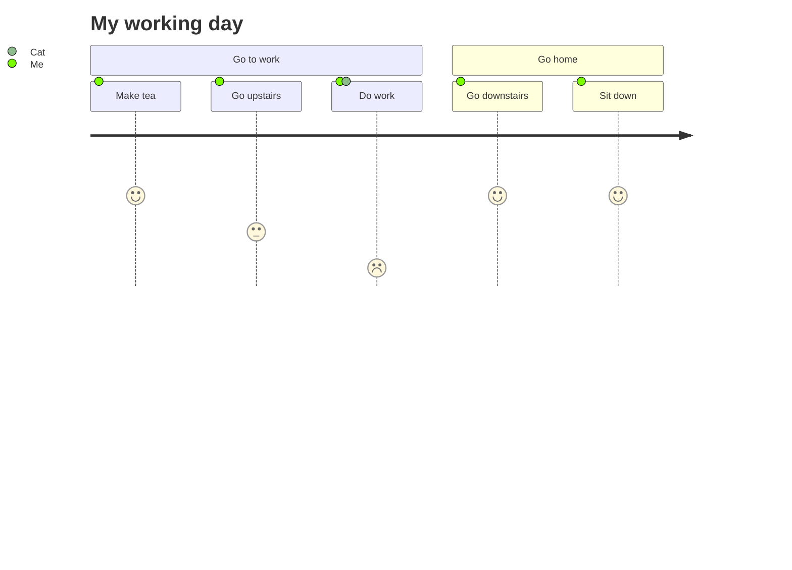
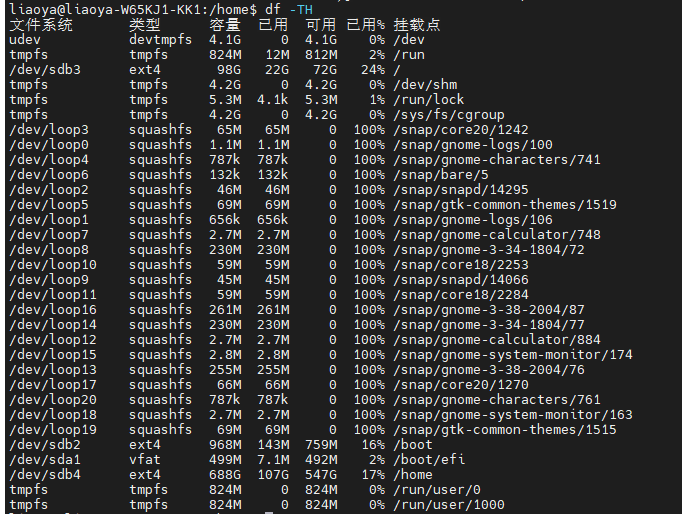
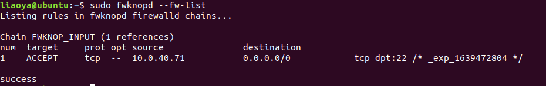
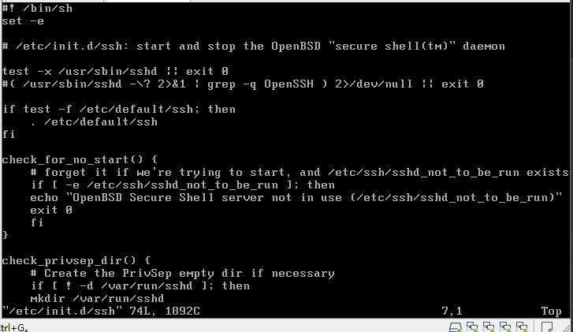
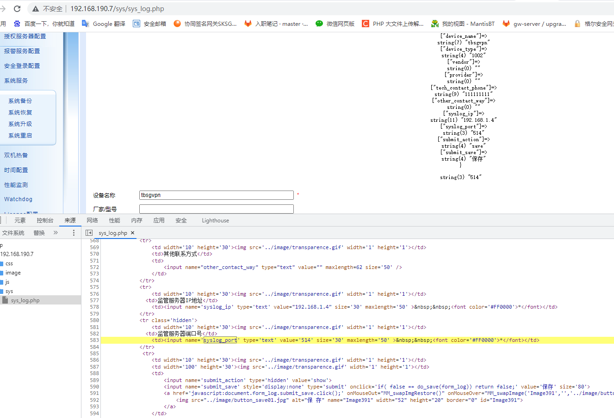
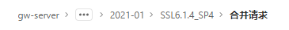

# 学习杂论

使用`typora`画流程图，类图，时许图等

```
```mermaid

```

几种常用图形

流程图

```
graph TD;
    A-->B;
    A-->C;
    B-->D;
    C-->D;
```


时序图

```
sequenceDiagram
    participant Alice
    participant Bob
    Alice->>John: Hello John, how are you?
    loop Healthcheck
        John->>John: Fight against hypochondria
    end
    Note right of John: Rational thoughts <br/>prevail!
    John-->>Alice: Great!
    John->>Bob: How about you?
    Bob-->>John: Jolly good!
```



类图

```
classDiagram
Class01 <|-- AveryLongClass : Cool
Class03 *-- Class04
Class05 o-- Class06
Class07 .. Class08
Class09 --> C2 : Where am i?
Class09 --* C3
Class09 --|> Class07
Class07 : equals()
Class07 : Object[] elementData
Class01 : size()
Class01 : int chimp
Class01 : int gorilla
Class08 <--> C2: Cool label
```




日程图




```
run：简记为 r ，其作用是运行程序，当遇到断点后，程序会在断点处停止运行，等待用户输入下一步的命令。
continue （简写c ）：继续执行，到下一个断点处（或运行结束）
next：（简写 n），单步跟踪程序，当遇到函数调用时，也不进入此函数体；此命令同 step 的主要区别是，step 遇到用户自定义的函数，将步进到函数中去运行，而 next 则直接调用函数，不会进入到函数体内。
step （简写s）：单步调试如果有函数调用，则进入函数；与命令n不同，n是不进入调用的函数的
```


格式化输出结构体

```
set print pretty on
```

设置显示结构体内的联合体数据

```
set print union
```


SP7三权设立地址

```
192.168.190.7/PrivManager.php
```


SP7三权默认密码

```
admin koaladmin123 sys koalsys123 audit koalaudit123
```


在`gdb`中使用`display argname`追踪变量`argname`的变化情况

VS2022使用`ctrl+-`将跳转到函数处返回到原处

用户认证网关

添加网段的时候不要和目标IP相同，比如192.168.190.7添加网段的时候新增为192.168.190.8

虚拟机中的共享文件夹路径

```
mnt/hgsf/
```


```
git config  --global user.name 你的目标用户名；
```


```
du -h --max-depth=1 //用于查看文件夹大小
```


```
cp -r -v dir1 dir2 //-v参数显示复制的详细信息，在复制大文件时安心点
```


解压`xxx.tar.xz`

```
xz -d xxx.tar.xz
tar xvf xxx.tar
```


备份系统已安装软件流程

```
sudo apt install apt-clone//安装工具
mkdir mypackage
sudo apt-clone clone ./mypackages
apt-clone info apt-clone-state-ubuntuserver.tar.gz
sudo apt-clone restore apt-clone-state-ubuntuserver.tar.gz
```




1.备份已安装软件包列表

```
　　dpkg --get-selections > /home/user/package.selections
```

　　2.备份Home下的用户文件夹

　　如果你已经将Home放在额外的分区，这一步就不必了，复制所有用户文件夹下的所有内容到另外的分区，注意要包含隐藏文件(Ctrl+Hide)

备份当前系统

　　3.备份软件源列表，将/etc/apt/文件夹下的`sources.list`拷贝出来保存即可

新系统安装后的恢复：
　　1.复制备份的`Sources.list`文件到新系统的`/etc/apt/`目录，覆盖原文件，并替换`(Ctrl+H)`文档中的`intrepid`为`jaunty`。然后更新软件源`(sudo apt-get update`)。

　　2.重新下载安装之前系统中的软件(如果你安装的软件数量比较多，可能会花费较长时间)

```
sudo dpkg --set-selections /home/package.selections && apt-get dselect-upgrade
```

　　3.最后将备份的主文件夹`(/home/用户名)`粘贴并覆盖现有主文件夹

　　用这个方法我们可以基本在不丢失现有系统和软件设置的情况下使用全新的`Ubuntu`系统了


压缩主目录的所有文件夹

```
tar cvpzf backup.tgz –-exclude=/proc –-exclude=/lost+found –-exclude=/backup.tgz –-exclude=/mnt –-exclude=/sys /
```


```
docker stop be9269f8c10f //停止容器
docker rm be9269f8c10f //删除容器
docker rm ia0a8887912c9 //删除镜像
docker commit be9269f8c10f demowebtest:1.0 //根据容器创建镜像
```


`docker`复制文件进容器，以及将容器内复制文件出来，其中`5fc4a`指代容器`ID`

```
docker cp -a 5fc4a:/usr/local/tomcat/webapps/demo/ /home/liaoya/github/test/
docker cp -a /home/liaoya/github/test/ 5fc4a:/usr/local/tomcat/webapps/demo/
```


停止`nginx`

```
nginx -s stop
```


容器内安装常用工具，首先查看容器是基于`linux`的哪个版本进行构建的

```
cat /etc/issue
```

如果是基于`debian`的就是使用`apt`如果是基于`Kernel`就使用`yum`

```
ls -lrt /usr/bin/java  用于查询文件来源位置
```


目前大数据密码安全的解决方案：一般而言不考虑。。。

核心三个部分

```
HDFS 分布式文件系统
MapReduce 分布式并行编程
YARN 资源管理和调查器
```

目前大数据几个难点方向

```
脱敏
查询
可搜索加密
存储
如何证明这个数据是你的？
```


```
docker ps -a //查看所有容器包括关闭了的容器
```


运行容器并将内容进行挂载在容器指定文件夹

```
docker run -i -t -v /root/software/:/mnt/software/ 5d0 /bin/bash
```


进入正在运行的容器内部

```
docker exec -it cc7021de44e98684dadccefc8d28946f217b9cae4e8a82c22df48b5ce108ea63 bash
```

其中容器`ID`是指容器运行的时候


使用`traceroute`跟踪路由跳转，其命令如下

```
traceroute 10.0.40.73
```


```
address//ip地址
network//网段地址
netmask//子网掩码
broadcast//广播地址
```


修改`git`配置方案

```
git config --global user.email "daiqf@koal.com"
```


扫描指定端口

```
sudo nmap -sS -p 22 10.0.40.72
```


`git`提交撤回提交解决方案

```
git log //查看历史提交记录
git reset --hard 版本号//回退到没有错误的提交版本号
git push origin 1-add-sm3 -f //提交到对应分支，-f参数强制提交，慎重慎重！！！！
```


查询文件内包含`hmac`字符的句子，并输出序号

```
egrep "hmac" -nr
```


使用`file`命令可以查看文件的编码方式

使用`hexdump`来查看转换编码后hex有没有发生变化

转换编码格式

```
iconv -f gbk -t utf-8 testcert_gbk.cnf > testcert_utf8.cnf
```


计算文件的hash值和base64编码

```
openssl dgst -md5 ./test.txt
openssl dgst -sha1 ./test.txt
openssl enc -base64 -in ./test.txt
```


打印证书信息

```
openssl x509 -in mysite.pem -noout -text
```


打印crl文件包括issuer，hash，lastupdate，nextupdate等

```
openssl crl -in test.crl -text -issuer -hash -lastupdate -nextupdate
```


其中ca选项里面的startdate和enddate为设定证书有效时间，其格式为UTCtime格式

```
openssl x509 -req -in mysite.req -CA ca.pem -CAkey mysite.key -out mysite.pem -startdate 20010101030303Z -enddate 20010102030303Z -CAcreateserial
```


在xftp连接到linux上时，将属性里面的编码设置为utf-8，不然中文文件从windows上传过去会变成乱码


```
-Wall 编译时会显示所有警告，建议带上
```


```
b fko_encrypt_spa_data //直接设置断点为函数
step //跳转到函数内
info addrfko_encrypt_spa_data //查看函数的地址空间
```


```
ldd a.out
```

查看应用文件链接的库


HMac作者邮箱

```
   Hugo Krawczyk
   IBM T.J. Watson Research Center
   P.O.Box 704
   Yorktown Heights, NY 10598

   EMail: hugo@watson.ibm.com

   Mihir Bellare
   Dept of Computer Science and Engineering
   Mail Code 0114
   University of California at San Diego
   9500 Gilman Drive
   La Jolla, CA 92093

   EMail: mihir@cs.ucsd.edu

   Ran Canetti
   IBM T.J. Watson Research Center
   P.O.Box 704
   Yorktown Heights, NY 10598

   EMail: canetti@watson.ibm.com
```


- gitlab配置公钥

  ```
  ssh-keygen -t rsa -C 'daiqf@koal.com'
  ```

  

- 然后打开`~/.ssh/id_rsa.pub`文件，复制里面的内容
- 打开gitlab,找到Profile Settings-->SSH Keys--->Add SSH Key,并把上一步中复制的内容粘贴到Key所对应的文本框，在Title对应的文本框中给这个sshkey设置一个名字，点击Add key按钮


- 查看当前提交方式

  ```
  git remote -v
  ```

  

- 删除当前提交方式

  ```
  git remote rm origin
  ```

- 将提交方式修改为ssh

  ```
  git remote add origin git@xxx.git  
  ```

  

在SPA通过后，服务端会在防火墙增加一条规则



在服务端按照此命令`fwknopd -f`将不会把日志输出到日志，而是在界面显示

关闭`fwknopd`指令为`fwknopd -K`

目前能做的

枚举类型，初始化第一个值，后续自动+1

```
enum {
    FKO_DIGEST_NAME     = 0x100,
    ENCRYPTION_MODE,
    NAT_LOCAL,
    NAT_PORT,
    NAT_RAND_PORT,
    NO_HOME_DIR,
    NO_RC_FILE,
    TIME_OFFSET_MINUS,
    TIME_OFFSET_PLUS,
    SAVE_RC_STANZA,
    FORCE_SAVE_RC_STANZA,
    STANZA_LIST,
    NO_SAVE_ARGS,
    SHOW_LAST_ARGS,
    RC_FILE_PATH,
    RESOLVE_HTTP_ONLY,
    RESOLVE_URL,
    SERVER_RESOLVE_IPV4,
    USE_HMAC,
    USE_WGET_USER_AGENT,
    SPA_ICMP_TYPE,
    SPA_ICMP_CODE,
    KEY_LEN,
    HMAC_DIGEST_TYPE,
    HMAC_KEY_LEN,
    GET_HMAC_KEY,
    KEY_RIJNDAEL,
    KEY_RIJNDAEL_BASE64,
    KEY_HMAC_BASE64,
    KEY_HMAC,
    FD_SET_STDIN,
    FD_SET_ALT,
    FAULT_INJECTION_TAG,

    /* Put GPG-related items below the following line */
    GPG_ENCRYPTION      = 0x200,
    GPG_RECIP_KEY,
    GPG_SIGNER_KEY,
    GPG_HOME_DIR,
    GPG_EXE_PATH,
    GPG_AGENT,
    GPG_ALLOW_NO_SIGNING_PW,
    NOOP /* Just to be a marker for the end */
};

```


关闭`fwknop`

```
[spaserver]# service fwknop status
fwknop: unrecognized service
[spaserver]# cd fwknop.git/extras/upstart
[spaserver]# cp fwknop.conf /etc/init
[spaserver]# service fwknop status
fwknop stop/waiting
```


```
iptables -L -n --line-number//将防火墙规则以序号列出来
iptables -D INPUT 2//删除IPPUT表内的2号规则
```

```
fwknop -n 1 --verbose -R
```


格尔源

```
deb http://debian.koal.com/bionic/ bionic main restricted universe multiverse
deb http://debian.koal.com/bionic/ bionic-updates main restricted universe multiverse
deb http://debian.koal.com/bionic/ bionic-security main restricted universe multiverse
#Ubuntu 18.04 LTS源代码
deb-src http://debian.koal.com/bionic/ bionic main restricted universe multiverse
deb-src http://debian.koal.com/bionic/ bionic-updates main restricted universe multiverse
deb-src http://debian.koal.com/bionic/ bionic-security main restricted universe multiverse
```


```
unlink(string $filename, resource $context = ?): bool
Deletes filename. Similar to the Unix C unlink() function. An E_WARNING level error will be generated on failure.
Returns true on success or false on failure.
删除文件名，返回true是删除成功，返回false是删除失败

```


```
mb_convert_encoding(array|string $string, string $to_encoding, array|string|null $from_encoding = null): array|string|false
```

将字符串的字符编码从可选的 from_encoding 转换为 to_encoding。 如果 string 是一个数组，它的所有字符串值将被递归转换。以下是实例，将`UTF-8`转化为`GBK`

```
mb_convert_encoding($child_node->get_content(), 'GBK', 'UTF-8')
```


```
simplexml_load_file(
    string $filename,
    ?string $class_name = SimpleXMLElement::class,
    int $options = 0,
    string $namespace_or_prefix = "",
    bool $is_prefix = false
): SimpleXMLElement|false
```

将给定文件中格式正确的 XML 文档转换为对象。


```
/etc/init.d/ssh  //这个注释掉(test -x /usr/sbin/sshd ||exit 0)下面那行不然连不上sftp
```




make会把其要执行的命令行在命令执行前输出到屏幕上。当我们用“@”字符在命令
行前，那么，这个命令将不被make显示出来

```
str_arr = explode("/", $str);//php中将str根据/拆分成字符串数组，赋值给str_arr
end(str_arr);//php中将指针指向str_arr最后一个位置，将其内容返回
in_array( $name, $this->getModel()->keys())//检查name是否在$this->getModel()->keys()中

```


HTTP Redirect重写，就是如果应用地址是10.0.80.141:8080,想访问到10.0.80.114:446，那么就将HTTP Redirect功能开启，将端口设置为446

开启HTTP Redirect 端口设置为443

其应用场景为http访问10.0.80.114:80时，将其重定向为https10.0.80.114:443


看配置文件中写的是什么路径，配置文件追踪，cfg->NRP->然后看服务序号对应的文件夹->然后找到对应服务的配置文件

当前协同签名网关中的缓存配置文件位置为

```
cfg/NRP/2/protocol-http.conf
```

其缓存位置为

```
/var/log/NRP/2/proxy_cache_dir
```


```
exec( "openssl x509 -in /tmp/tmpcert.pem -purpose | grep -qx 'SSL client : Yes'", $results, $ret );
```

上文中的`exec`执行命令，`openssl x509 -in /tmp/tmpcert.pem -purpose | grep -qx 'SSL client : Yes'"`是执行的命令`result`是执行的结果，`ret`是返回的状态，执行成功返回0，失败会返回非0




MAS是反向代理的测速功能，配置反向代理，开启访问测速，访问反向代理对应的地址

```
https://10.0.80.141:12347/speed_get_test/1024
```


## html

***\*proxy_redirect\****


## 打包

使用DockerFile搭建一个容器，使用docker build命令，然后运行这个容器，然后用网关的反向代理访问这个这个网站，然后进行测试

[网关升级包打包环境](http://10.0.80.130/app/pack-web/)

这个网址是瑞明哥搭建的，如果访问不了，让瑞明哥打开一下

选择时间，打开改bug的项目，项目前面那个就是时间，选择项目，选择分支(有时是master，有时是main，一般新创建的项目默认都是main)，测试的话，正式打包不应该勾选。点击制作升级包，等待打包完成怎么查找是在这里找




## Web界面


## php

```
$("#ip").val("");//将ip选项设值为空
```

## openssl

验证证书

openssl verify -CAfile ca.pem client.pem


## 网关

SKSGW2411

```
kssl/GAD/php/web/module/srv/nrp/cert_param.php//创建服务以及在参数修改时证书界面相关
kssl/GAD/php/web/module/srv/sct/service_cert.php//不同的服务，相同的证书界面
kssl/GAD/php/web/js/selectCert2.js//这个是选择证书和取消选择时对应的js文件
kssl/GAD/php/web/js/selectCert.js//等同于上面，但很少看见调用这个，改的时候一并改
kssl/GAD/php/web/module/cert/ca/model/CertModel.php//这个是证书的信息结构体编辑页面，上面几个查询证书信息都是从这里进行查询的。

```

以上如果有不理解的参考下面这个MR

```
http://git.koal.com/gw-server/upgrade/2021-01/SSL6.1.4_SP4/-/merge_requests/315/diffs#ce94577708fca330eac72c94c08d354d34e89500
```

```
vi /cfg/GAD/core/site.d/default-port //查看监听的端口地址
```

查看端口监听

[协同签名网关管理系统 / 用户登录](http://10.0.80.141/login)

## Openssl命令

从pfx中获取客户端证书

```shell
openssl pkcs12 -in client.pfx  -password pass:11111111 -clcerts -nokeys -out clientcert.pem
```

从pfx中获取客户端私钥

```shell
openssl pkcs12 -in client.pfx  -password pass:11111111 -nocerts -out clientkey.pem
```


## 缓存


### **Cache-Control**

在HTTP/1.1中，Cache-Control是最重要的规则，主要用于控制网页缓存。比如当 Cache-Control:max-age=300时，则代表在这个请求正确返回时间（浏览器也会记录下来）的5分钟内再次加载资源，就会命中强缓存。


public：所有内容都将被缓存（客户端和代理服务器都可缓存）。具体来说响应可被任何中间节点缓存，如 Browser <-- proxy1 <-- proxy2 <-- Server，中间的proxy可以缓存资源，比如下次再请求同一资源proxy1直接把自己缓存的东西给 Browser 而不再向proxy2要。

private：所有内容只有客户端可以缓存，Cache-Control的默认取值。具体来说，表示中间节点不允许缓存，对于Browser <-- proxy1 <-- proxy2 <-- Server，proxy 会老老实实把Server 返回的数据发送给proxy1,自己不缓存任何数据。当下次Browser再次请求时proxy会做好请求转发而不是自作主张给自己缓存的数据。

no-cache：客户端缓存内容，是否使用缓存则需要经过协商缓存来验证决定。表示不使用 Cache-Control的缓存控制方式做前置验证，而是使用 Etag 或者Last-Modified字段来控制缓存。需要注意的是，no-cache这个名字有一点误导。设置了no-cache之后，并不是说浏览器就不再缓存数据，只是浏览器在使用缓存数据时，需要先确认一下数据是否还跟服务器保持一致。

no-store：所有内容都不会被缓存，即不使用强制缓存，也不使用协商缓存

max-age：max-age=xxx (xxx is numeric)表示缓存内容将在xxx秒后失效

s-maxage（单位为s)：同max-age作用一样，只在代理服务器中生效（比如CDN缓存）。比如当s-maxage=60时，在这60秒中，即使更新了CDN的内容，浏览器也不会进行请求。max-age用于普通缓存，而s-maxage用于代理缓存。s-maxage的优先级高于max-age。如果存在s-maxage，则会覆盖掉max-age和Expires header。

max-stale：能容忍的最大过期时间。max-stale指令标示了客户端愿意接收一个已经过期了的响应。如果指定了max-stale的值，则最大容忍时间为对应的秒数。如果没有指定，那么说明浏览器愿意接收任何age的响应（age表示响应由源站生成或确认的时间与当前时间的差值）。

min-fresh：能够容忍的最小新鲜度。min-fresh标示了客户端不愿意接受新鲜度不多于当前的age加上min-fresh设定的时间之和的响应。


## **协商缓存**

 

协商缓存就是强制缓存失效后，浏览器携带缓存标识向服务器发起请求，由服务器根据缓存标识决定是否使用缓存的过程，主要有以下两种情况：

**协商缓存生效，返回304和Not Modified：**


**协商缓存失效，返回200和请求结果：**


## **缓存机制**

强制缓存优先于协商缓存进行，若强制缓存(Expires和Cache-Control)生效则直接使用缓存，若不生效则进行协商缓存(Last-Modified / If-Modified-Since和Etag / If-None-Match)，协商缓存由服务器决定是否使用缓存，若协商缓存失效，那么代表该请求的缓存失效，返回200，重新返回资源和缓存标识，再存入浏览器缓存中；生效则返回304，继续使用缓存。具体流程图如下：


## ForceType 指令

| [说明](http://www.jinbuguo.com/apache/manual/mod/directive-dict.html#Description) | 强制所有匹配的文件被作为指定的MIME类型进行伺服 |
| :----------------------------------------------------------- | ---------------------------------------------- |
| [语法](http://www.jinbuguo.com/apache/manual/mod/directive-dict.html#Syntax) | `ForceType MIME-type|None`                     |
| [作用域](http://www.jinbuguo.com/apache/manual/mod/directive-dict.html#Context) | directory, .htaccess                           |
| [覆盖项](http://www.jinbuguo.com/apache/manual/mod/directive-dict.html#Override) | FileInfo                                       |
| [状态](http://www.jinbuguo.com/apache/manual/mod/directive-dict.html#Status) | 核心(C)                                        |
| [模块](http://www.jinbuguo.com/apache/manual/mod/directive-dict.html#Module) | core                                           |
| [兼容性](http://www.jinbuguo.com/apache/manual/mod/directive-dict.html#Compatibility) | Apache 2.0之后从其它模块移动到核心中           |

当此指令放入`.htaccess`文件或`<Directory>`或`<Location>`或`<Files>`配置段时，此指令强制所有匹配的文件被当作在MIME-type中指定的Content-Type来伺服。比如说，如果您有一个包含大量GIF文件的目录，可您又不想全都为它们加上"`.gif`"扩展名的话，您可以这样做：

```
ForceType image/gif
```

请注意：与`DefaultType`指令不同，此指令将覆盖所有的mime类型关联，包括标识文件类型的扩展名。

你可以通过使用"`None`"覆盖任何`ForceType`设置：

```c
# 强制所有文件为 image/gif:
<Location /images>ForceType image/gif</Location>
# 但是正常的mime类型关联在这里:
<Location /images/mixed>ForceType
    None
</Location>
```

## Shell脚本

- Set -e 

  你写的每个脚本都应该在文件开头加上set -e,这句语句告诉bash如果任何语句的执行结果不是true则应该退出。
  这样的好处是防止错误像滚雪球般变大导致一个致命的错误，而这些错误本应该在之前就被处理掉。如果要增加可读性，可以使用set -o errexit，它的作用与set -e相同。
  
- 2>&1
  
  ```text
  ./test.sh  > log.txt 2>&1
  ```
  
  这里的2>&1是什么意思？该如何理解？
  先说结论：上面的调用表明将./test.sh的输出重定向到log.txt文件中，同时将标准错误也重定向到log.txt文件中。
  
  
  
  
  
  每个程序在运行后，都会至少打开三个文件描述符，分别是0：标准输入；1：标准输出；2：标准错误。
  例如，对于前面的test.sh脚本，我们通过下面的步骤看到它至少打开了三个文件描述符：
  
  ```text
  ./test.sh    #运行脚本
  ps -ef|grep test.sh  #重新打开命令串口，使用ps命令找到test.sh的pid
  hyb       5270  4514  0 19:20 pts/7    00:00:00 /bin/bash ./test.sh
  hyb       5315  5282  0 19:20 pts/11   00:00:00 grep --color=auto test.sh
  ```
  
  可以看到test.sh的pid为5270，进入到相关fd目录：
  
  ```text
  cd /proc/5270/fd   #进程5270所有打开的文件描述符信息都在此
  ls -l              #列出目录下的内容
   0 -> /dev/pts/7
   1 -> /dev/pts/7
   2 -> /dev/pts/7
   255 -> /home/hyb/workspaces/shell/test.sh
  ```
  
  可以看到，test.sh打开了0，1，2三个文件描述符。同样的，如果有兴趣，也可以查看其他运行进程的文件描述符打开情况，除非关闭了否则都会有这三个文件描述符。
  
  那么现在就容易理解前面的疑问了，2>&1表明将文件描述2（标准错误输出）的内容重定向到文件描述符1（标准输出），为什么1前面需要&？当没有&时，1会被认为是一个普通的文件，有&表示重定向的目标不是一个文件，而是一个文件描述符。在前面我们知道，test.sh >log.txt又将文件描述符1的内容重定向到了文件log.txt，那么最终标准错误也会重定向到log.txt。我们同样通过前面的方法，可以看到test.sh进程的文件描述符情况如下：
  
  ```text
   0 -> /dev/pts/7
   1 -> /home/hyb/workspaces/shell/log.txt
   2 -> /home/hyb/workspaces/shell/log.txt
   255 -> /home/hyb/workspaces/shell/test.sh
  ```
  
  我们可以很明显地看到，**文件描述符1和2都指向了log.txt文件，**也就得到了我们最终想要的效果：**将标准错误输出重定向到文件中**。
  它们还有两种等价写法：
  
  ```text
  ./test.sh  >& log.txt
  ./test.sh  &> log.txt
  ```

