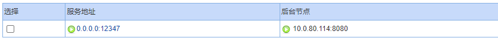
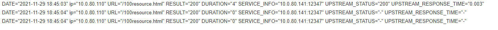
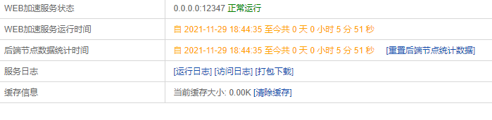
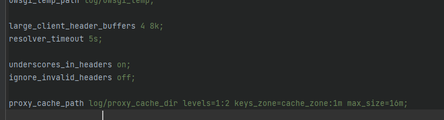
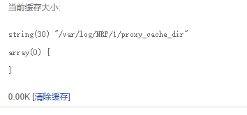
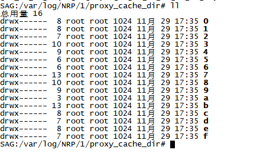
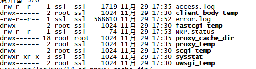
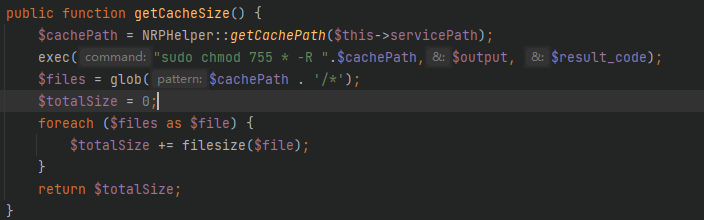
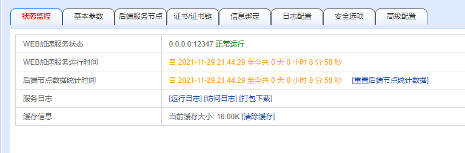
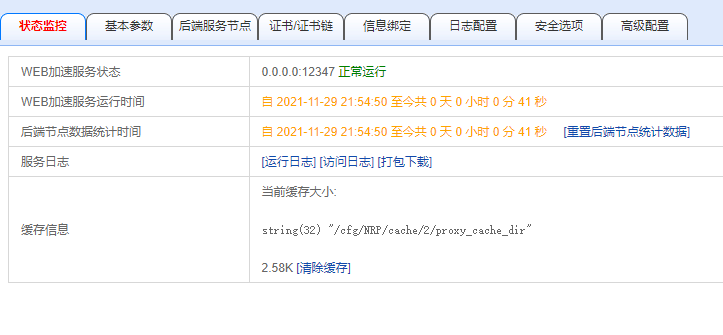

# SP4状态监控栏目不能显示缓存信息

## 问题详情

在WEB加速服务中配置反向代理到一个多图界面，无论设置为内存还是磁盘，状态监控栏目的缓存信息恒定为0

## 问题复现

配置一个反向代理，开启缓存和运行日志，在高级配置中将大缓存文件位置设置为磁盘

通过反向代理访问该多图网页`https://10.0.80.141:12347/100resource.html`，能够看到加载了很多图片

查看访问日志，通过响应时间来看，缓存应该是成功的

而此时状态监控界面上的缓存信息仍然显示为0

## 问题追踪

进入`cfg/NRP/1/protocol-http.conf`查看当前服务的缓存配置

在界面打印显示的缓存文件的路径和该路径下文件夹数组

两者路径一致，进入后台`/var/log/NRP/1/proxy_cache_dir`，发现下面有缓存文件，但对应的文件夹数组却是空的。

查`/var/log/NRP/1/`目录下的权限情况，发现该目录下的`proxy_cache_dir`的权限为不能读取

在启动服务的时候开始创建`/var/log/NRP/1`文件夹，如果在之前开启了缓存，那么这个文件夹里面会包括`proxy_cache_dir`

## 问题解决

在检测文件夹内容时，先对文件夹内的文件赋予读取权限

## 测试验证

配置为磁盘，能够正常显示缓存大小

清空缓存，配置为内存盘，能够正常显示缓存大小

