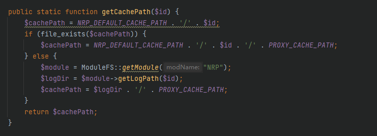
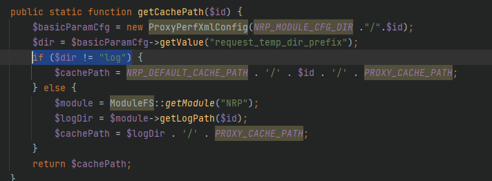
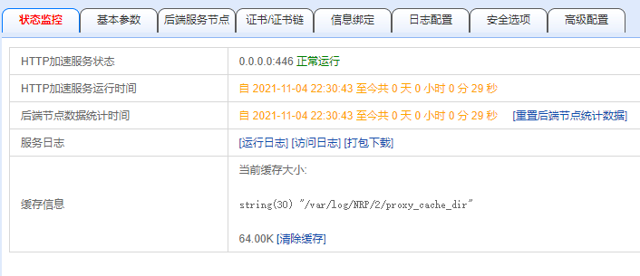
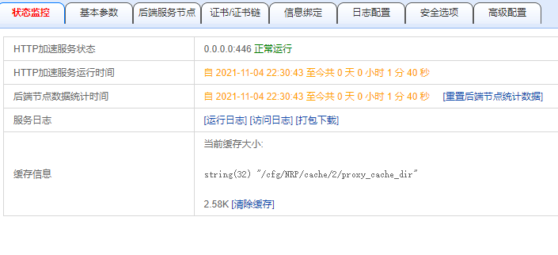

# http代理服务 页面缓存位置为磁盘时 有缓存文件 但界面显示大小为0

## 问题详情

http://10.0.1.8/mantis/view.php?id=62703

## 问题复现

配置一个HTTP代理，配置好缓存

代理到一个多图地址，访问该地址

在访问日志里面查看访问日志，确定缓存成功

在状态监控栏目，查看缓存大小仍然为0

问题复现

## 问题追踪

进入`cfg/NRP/2/protocol-http.conf`查看当前服务的缓存配置

在后台进入对应路径`/var/log/NRP/2/proxy_cache_dir`，查看缓存信息，缓存成功了

那么问题应该是状态监控栏目的缓存信息没有读取到正确位置，在后台打印缓存信息读取的路径为`/cfg/NRP/cache/2/proxy_cache_dir`

找寻到其请求路径的判断函数`kssl/GAD/php/srv/nrp/NRPHelper.php`，根据设计，当在高级参数大请求缓冲文件位置选择磁盘的时候，路径应该为`/var/log/`当设置为内存盘，其请求到的路径应该为`/cfg/NRP/cache/X`

对判断语句进行分析，它判断的是`/cfg/NRP/cache/X`有没有这个路径是否存在，如果不存在就将返回的路径设置为`/var/log/`。经过测试发现，无论高级参数中的大请求缓冲文件位置是磁盘还是内存，其对应的文件夹都存在，也就是其读取的路径恒定为`/cfg/NRP/cache/X`，

## 问题解决

将判断条件进行修改，也即判断高级参数中的大请求缓冲文件为磁盘还是内存来分类处理。即解析高级配置保存的文件路径`cfg/NRP/2/advance.xml`，对其中的取值`request_temp_dir_prefix`进行判断，其取值有两个，一个为`log`一个为`/cfg/NRP/cache/`，其中`log`对应的是磁盘，`/cfg/NRP/cache/`对应的是内存。根据其取值返回不同的路径。

## 测试验证

在HTTP状态界面刷新，配置为磁盘，能够正确显示路径

配置为内存，路径地址发生改变了

