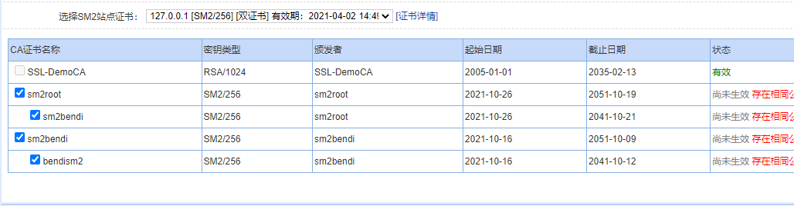
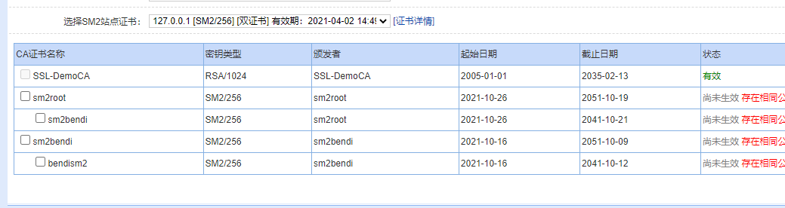
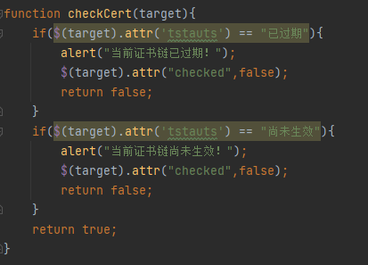
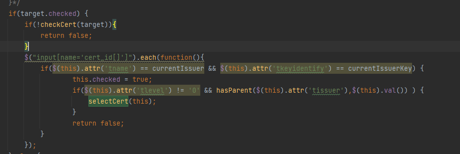
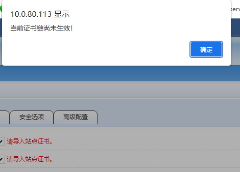
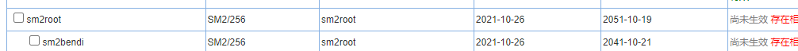
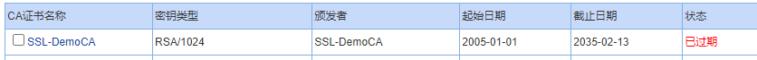

# 在服务证书链界面勾选过期或者尚未生效证书链，勾选后能够保存，实际上没有保存

## 问题详情

调整系统时间，让某CA证书链尚未生效，在Web加速服务界面选择尚未生效的CA证书链

点击保存后，被选中的尚未生效的证书链并没有保存

## 问题追踪

追踪到代码`kssl/GAD/www/js/selectCert2.js`，对应的勾选函数`selectCert`，没有对证书链的有效情况进行判断

## 问题解决

增加检测证书状态函数

在勾选CA证书链之前先检测该证书状态是否合法，不合法则提示错误，取消勾选，退出函数

## 测试验证

调整系统时间，让某CA证书状态变为尚未生效

勾选证书链，提示报错

同时勾选的证书链变为尚未勾选状态。

设置系统时间，直至某证书链过期

在WEB加速服务的证书链界面勾选该CA证书链，提示该证书链已经过期，并将勾选变为尚未勾选状态

