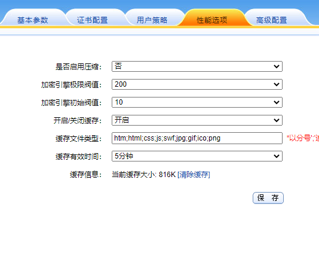
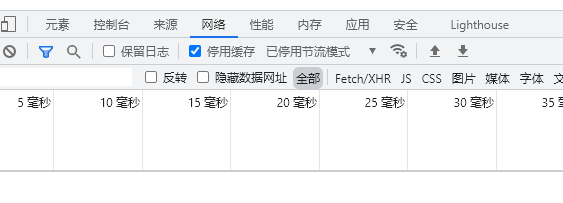
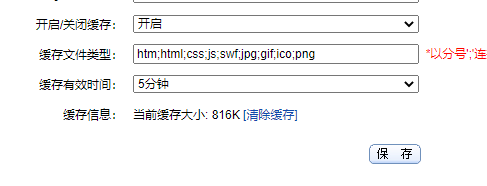
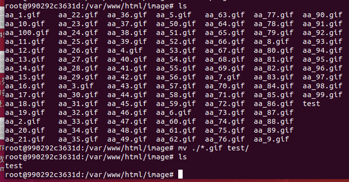

# 测试任务

  

## 测试信息绑定

### 测试流程

- 设置网关反向代理到容器指定网页
- 将客户端验证设置为强制验证
- 在证书链处勾选客户端证书对应的证书链
- 开启信息绑定功能，勾选对应绑定信息

### 验证

- 反向代理到`httpvars.php`,打开链接，得到此时传送到应用服务器的绑定信息`Cookie`
- 对比客户端验证时提交的证书信息
- 两者一致

## 测试网关缓存

### 测试流程

- 将http代理设置开启缓存

  

- 确定缓存类型中有jpg

- 设置反向代理到网页`100resource.html`，访问该代理ip`https://192.168.190.7:15663/100resource.html`，关闭浏览器缓存。

  

- 此时，缓存信息里面已经显示出当前的缓存大小为816k

  

  - 在应用服务器将对应图片删除
  - 
  - 

### 验证

- 关闭浏览器缓存，打开对应链接，删除浏览器对应缓存
- 将容器内对应的图片移动到另外一个文件夹
- 刷新页面，页面正常显示
- 找到网关缓存对应文件夹，能够看到对应图片。

## 测试302跳转

### 测试流程

- 打开http代理，将其反向代理至302文件夹
- 将自定义的Host字段值修改为`172.17.0.2`，将需强制改写的Location中的Host字段值配置为`10.0.80.141:12347/302`
- 

### 验证

## 测试上传1G文件

### 测试流程

### 验证

