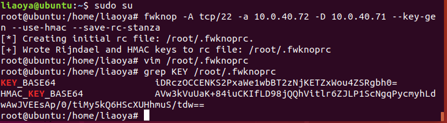
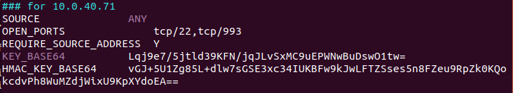
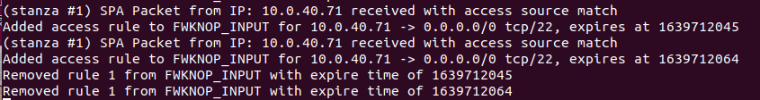

# ubuntu安装fwknop并进行测试

## fwknop介绍

`fwknop`是用于服务端向所有用户隐藏了服务端口的前提下，客户端可以使用之前约定的`KEY`，通过`fwknop`来打开指定的端口，这个端口只面向该客户端开放。

## 安装fwknop

`fwknop`至少需要两台机子才能使用或者测试，当前配置两台虚拟机，一台作为服务端，`ubuntu18.04 (10.0.40.71)`，一台作为客户端`ubuntu18.04(10.0.40.72)`。

### 命令行安装

- 在`10.0.40.71`上面安装`fwknop-server`，其命令为

  ```
  apt-get install libfko3
  apt-get install libgpgme11
  apt-get install libpcap0.8
  apt-get install fwknop-server
  ```

  检查服务端是否安装成功，进入`root`身份执行`fwknopd -V`，安装成功则会显示服务端版本号

  

- 在`10.0.40.72`上安装`fwknop-client`，其命令是

  ```
  apt-get install libfko3
  apt-get install libgpgme11
  apt-get install libpcap0.8
  apt-get install fwknop-client
  ```
  检查客户端是否安装成功，进入`root`身份执行`fwknop -V`，成功则会显示客户端版本号。

	

### 源码安装

- 获取源码

  - 从`gitee`获取

    ```
    git clone https://gitee.com/golikang/fwknop.git
    ```

  - 从官方获取(当前最新版本为2.6.10)

    ```
    wget http://www.cipherdyne.org/fwknop/download/fwknop-2.6.10.tar.gz
    tar -zvxf fwknop-2.6.10.tar.gz
    ```

- 安装依赖

  - ```
    sudo apt-get install openssl
    ```

  - ```
    sudo apt-get install texinfo
    ```

  - ```
    sudo apt-get install libtool
    ```

  - ```
    sudo apt-get install libpcap-devel
    ```

  - 安装`libpcap`

    - 下载文件`http://tcpdump.org/release`选择最新的版本
    - 解压`tar zxvf libpcap-1.10.0.tar.gz`
    - `sudo apt-get install flex`
    - `./configure`
    - `sudo make && make install`

- 安装服务端(`10.0.40.71`)流程

  - ```
    cd fwknop/
    ./autogen.sh
    libtoolize --force
    aclocal
    autoheader
    automake --force-missing --add-missing
    autoconf
    ./configure --prefix=/usr --sysconfdir=/etc --disable-client
    ```
  - 
  - ```
    make && make install
    ```

- 安装客户端(`10.0.40.72`)流程

  - ```
    cd fwknop/
    ./autogen.sh #这个步骤好似可以省略，我从官网获取时，没有这个文件，安装依然成功运行
    libtoolize --force
    aclocal
    autoheader
    automake --force-missing --add-missing
    autoconf
    ./configure --prefix=/usr --sysconfdir=/etc --disable-server
    ```
  - 
  - ```
    make && make install
    ```
## 测试fwknop

### 测试前准备

- 在服务端使用防火墙过滤端口22

  - ```
    iptables -I INPUT 1 -i ens33 -p tcp --dport 22 -j DROP
    iptables -I INPUT 1 -i ens33 -p tcp -m conntrack --ctstate ESTABLISHED,RELATED -j ACCEPT
    ```

  - 在客户端使用`nmap`扫描服务端端口`22`，可以看到端口状态为`filtered`，其命令为`sudo nmap -sS -p 22 10.0.40.71`

    

- 配置fwknop的hmac

  - 在客户端生成`KEY`，指定这个`KEY`用于`10.0.40.72`打开`10.0.40.71`的`22`端口，显示生成的`KEY`

    ```
    fwknop -A tcp/22 -a 10.0.40.72 -D 10.0.40.71 --key-gen --use-hmac --save-rc-stanza
    grep KEY /root/.fwknoprc
    ```
    
    
  - 将生成`KEY_BASE64`和`HMAC_KEY_BASE64`复制到服务端路径的`/etc/fwknop/access.conf`，添加字样`REQUIRE_SOURCE_ADDRESS`，其显示如下。
  
    
  
  - 修改`/etc/fwknop/fwknopd.conf`的`PCAP_INTF`的取值为当前主机实际使用的网卡名称
  
    
  
  - 启动`fwknopd`，检查其运行状态
  
    ```
    sudo fwknopd
    sudo fwknopd -S
    ```
  
    

### 测试

- 在测试前准备环节中我们已经使用防火墙过滤掉所有访问`22`端口的请求。在客户端使用`nmap`扫描服务端端口`22`，可以看到端口状态为`filtered`

  

- 在客户端使用指令向服务发送`UDP`包，要求服务端只面向客户端打开`22`端口，命令为

  ```
  fwknop -n 10.0.40.71 --verbose -R
  ```

  

- 继续在客户端扫描`10.0.40.71`的`22`端口开放情况

  

## QA

- 怎么让`fwknop`打开多个端口

  ```
  [spaserver]# cat /etc/fwknop/access.conf
   
  SOURCE                     ANY
  OPEN_PORTS                 tcp/22, tcp/993
  REQUIRE_SOURCE_ADDRESS     Y
  REQUIRE_USERNAME           bob
  FW_ACCESS_TIMEOUT          30
  KEY_BASE64                 kgohbCga6D5a4YZ0dtbL8SEVbjI1A5KYrRvj0oqcKEk=
  HMAC_KEY_BASE64            Zig9ZYcqj5gYl2S/UpFNp76RlD7SniyN5Ser5WoIKM7zXS28eptWtLcuxCbnh/9R+MjVfUqmqVHqbEyWtHTj4w==
  ```

  

- 怎么让`fwknop`支持多个用户

  ```
  [spaserver]# cat /etc/fwknop/access.conf
   
  ### for bob
  SOURCE                     ANY
  OPEN_PORTS                 tcp/22, tcp/993
  REQUIRE_USERNAME           bob
  REQUIRE_SOURCE_ADDRESS     Y
  FW_ACCESS_TIMEOUT          30
  KEY_BASE64                 kgohbCga6D5a4YZ0dtbL8SEVbjI1A5KYrRvj0oqcKEk=
  HMAC_KEY_BASE64            Zig9ZYcqj5gYl2S/UpFNp76RlD7SniyN5Ser5WoIKM7zXS28eptWtLcuxCbnh/9R+MjVfUqmqVHqbEyWtHTj4w==
   
  ### for alice
  SOURCE                     ANY
  GPG_REMOTE_ID              7234ABCD
  GPG_DECRYPT_ID             EBCD1234
  GPG_ALLOW_NO_PW            Y
  REQUIRE_SOURCE_ADDRESS     Y
  REQUIRE_USERNAME           alice
  FW_ACCESS_TIMEOUT          30
  HMAC_KEY_BASE64            STQ9m03hxj+WXwOpxMuNHQkTAx/EtfAKaXQ3tK8+Azcy2zZpimzRzo4+I53cNZvPJaMBfXjZ9NsB98iOpHY7Tg==
   
  ### for john
  SOURCE                     3.3.3.0/24, 4.4.0.0/16
  OPEN_PORTS                 tcp/80
  REQUIRE_USERNAME           john
  REQUIRE_SOURCE_ADDRESS     Y
  FW_ACCESS_TIMEOUT          300
  KEY_BASE64                 bOx25a5kjXf8/TmNQO1IRD3s/E9iLoPaqUbOv8X4VBA=
  HMAC_KEY_BASE64            i0mIhR//1146/T+IMxDVZm1gosNVatvpqpCfkv4X6Xzv4E3SHR6AivCCWk/K/uLDpymyJr95KdEkagfGU4o5yw==
  ```

  

- 怎么防止重放攻击

  ```
  fwknop -n 10.0.40.72 --verbose -R
  ```

  以此命令为例，发送过来的`UDP`包包括了随机数，时间戳。

  

- 发送过来的UDP报文包括什么内容?

  

  - 密钥交换

    - 密钥由客户端生成，并通过手动加入服务端配置文件中

      

  - 身份验证
    - 检测该报文不是重放（时间戳和随机数)
    - 检测能否通过`HMAC`正确验证
    - 检测正文数据是否是通过服务端设置的密钥进行加密的
    - 正文包含的命令是否属于已授权命令

  - 端口开启
    - 添加一个临时规则，允许指定端口向客户端开启
    - 默认30秒后移除该规则，已经连接的保持连接

