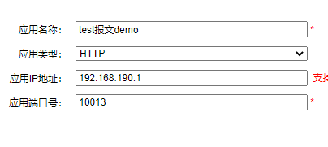
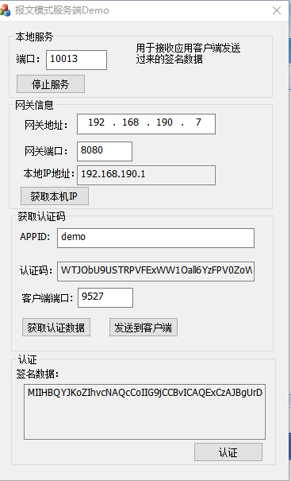
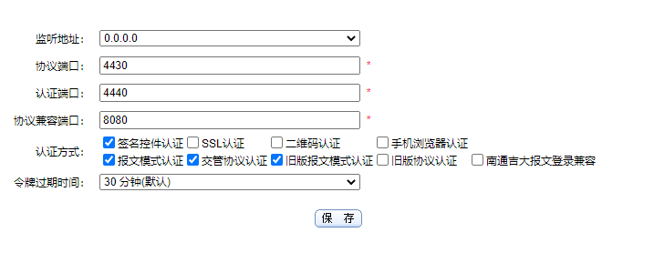
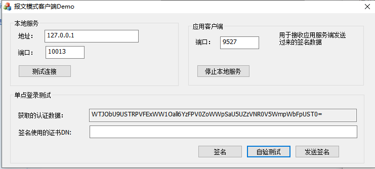
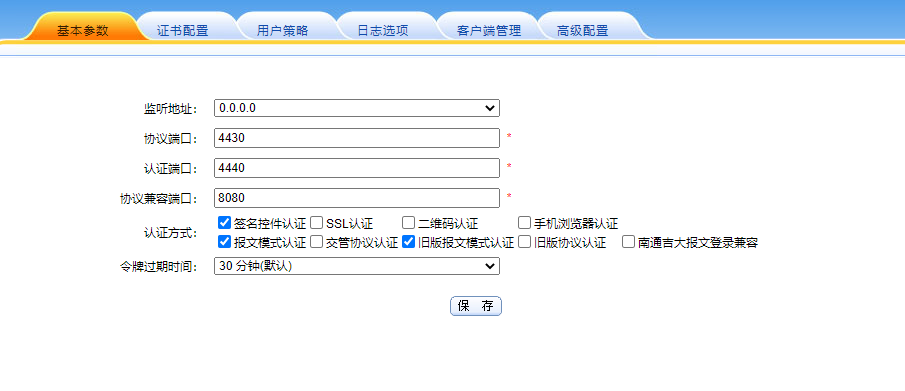
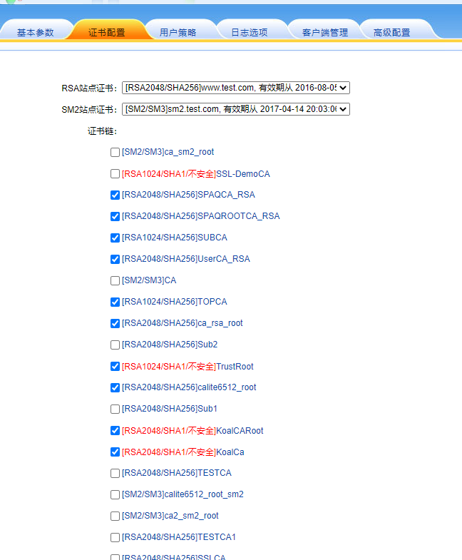
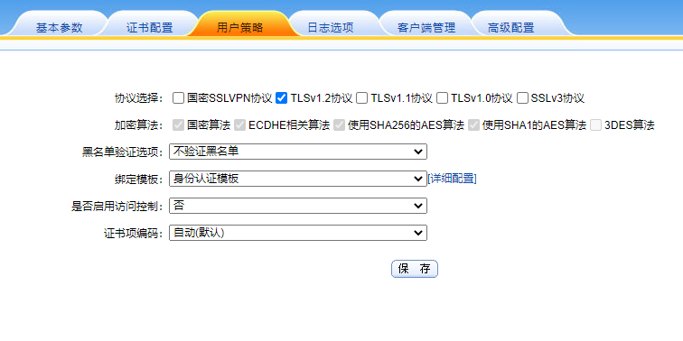
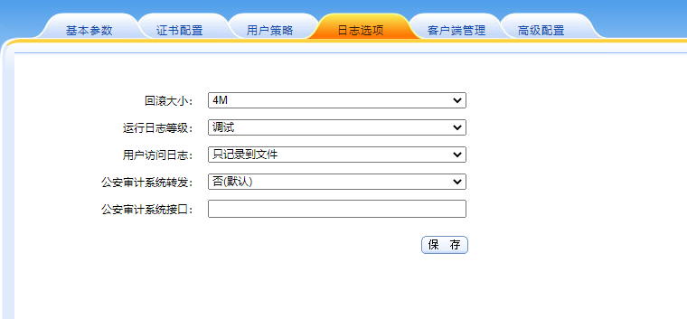
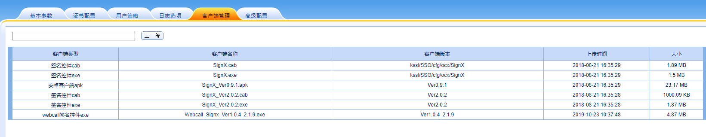
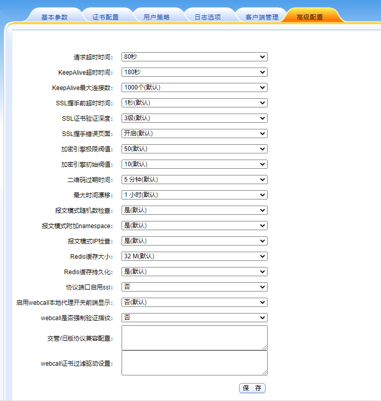

# 网关项目对接

## Web demo搭建

### 网关配置


### 应用服务器修改


## 报文demo搭建

网关，服务端，客户端

分别对应的是网关，wecall，网关

应用服务端是怎么验证客户端的签名的，不也是要通过网关吗？

这三者之间的逻辑是什么啊?先自己研究一下，要是还搞不定，下午问组长

## 网关配置

在用户管理->应用管理->新增应用

配置如下：



其中应用名称随便填，给自己看的，应用类型填`HTTP`，应用`IP`地址填写应用`IP`地址，这个地址应该和服务端获取的本机`IP`地址一致，应用端口号，填写的就是应用服务端开启的端口号，也就是服务器填写的端口号

## 服务端配置

服务端配置如下:



其中端口是由服务端决定的，客户端和网关进行应用端口的配置都需要和服务端一致。网关地址就是网关地址，网关端口填写身份认证服务基本参数中的协议兼容端口，填写结束后，点击获取本机IP，然后将这个本机IP填写到应用管理中应用服务地址中。



在应用服务管理的拓展里面填写APPID，然后点击随机生成，然后保存，在服务端管理那里填写APPID，然后填写客户端端口（这个是由客户端决定)，点击获取认证数据，获取成功。将其发送到客户端。

## 客户端配置

客户端配置如下:



其中地址的话就填写`127.0.0.1`就是本地的地址。也可以填写当前客户端所在的`IP`地址比如`10.0.40.70`，本地服务的端口是由服务端决定，服务端配置什么端口，这边就填写什么端口。

应用客户端的端口由客户端确定，客户端填写什么端口，服务端中的客户端端口选项就填写什么端口

点击测试连接，看能否正常连接上服务端，需要服务端开启服务

点击开启服务，服务端配置正确能够连接上客户端。

获取到服务端发送过来的数据，点击签名选择合适的证书进行签名，签名之后点击发送，发送给服务端，服务端点击认证，会从网关获取证书链对其进行验证，验证通过，就合格。

## 是什么东西

单点登录，一次登录，能够在所有应用不需再次登录

## 怎么部署

### 身份认证服务参数参考

- 基本参数

  

- 证书配置

  

- 用户策略

  

- 日志选项

  

- 客户端管理

  

- 高级配置

  

## 怎么使用

- 除了网关设置，还需要再应用服务器上进行配置，这个参考`Java-Agent部署手册`

## 怎么验证

- 查看日志信息

  ```
  2022-01-06 13:33:34 From:10.0.40.70:59163 APPID=nanzhou166 URL=http://10.0.250.166/login_gw ActiveX_VerifySignedMessage FAILED
  
  ```

  


## 注意的点

- 高级配置中的webcall是否强制验证指纹设置为否
- 